## 开始使用`Julia`

## `REPL`的使用

在`Julia`的`REPL`下，有多种模式

+ `help`模式，按`?`进入`help`模式
+ `shell`模式，按`;`进入`shell`模式
+ `package`模式，按`]`进入`package`模式
+ 按`backspace`键返回正常`Julia`模式

在`help`模式下，可以查看各种帮助文档，就相当于执行`@doc`命令

在`package`模式下，可以增加、删除各种库，相当于用`Pkg`这个模块来操作；`package`模式下的`add GR`相当于`Pkg.add("GR")`；`package`模式下的`rm GR`相当于`Pkg.rm("GR")`

其他关于`package`的操作

~~~julia
Pkg.installed() #查看已经安装的库和它们的版本
Pkg.update()  #升级安装的库
~~~

## 变量、整型、浮点型

向其他的动态语言一样，可以无需声明变量直接赋值。

~~~julia
x = 10
x = "Hello World!"
x = 1.1
x = "这是Julia教程"
~~~

变量名还可以是中文，当然不推荐这么做

~~~julia
测试 = 10
测试 + 1
~~~

还可以输入`\`+符号名称来输入更多的`Unicode`数学字符，如输入`\alpha`后按下`tab`键就会出现$\alpha$的字符。

### 命名规范

+ 变量名尽量小写
+ 类型和模块首字母大写，单词间使用驼峰式分隔
+ 函数名和宏名使用小写字母，不使用下划线
+ 修改参数的函数结尾使用`!`，这样的函数被称为`mutating functions`或`in-place function`
+ 在几个单词不易区分时才以`_`分割，一般不鼓励使用`_`

~~~julia
function ff!(x)#表示输入的参数会被函数改变
    x[end] = 4
end

y = [1,2,3]

ff!(y)
println(y)
~~~

### 整数和浮点数

#### 整数

| `Type` | `Signed` |      | `Number of bits` | `Smallest value` | `Largest value` |
| ------ | -------- | ---- | ---------------- | ---------------- | --------------- |
| `Bool` | `N/A`    |      | $8$              | `false(0)`       | `true(1)`       |

| `int8`    | √    |      | $8$   | $-2^7$     | $2^7-1$     |
| --------- | ---- | ---- | ----- | ---------- | ----------- |
| `Uint8`   |      |      | $8$   | $0$        | $2^8-1$     |
| `int16`   | √    |      | $16$  | $-2^{15}$  | $2^{15}-1$  |
| `Uint16`  |      |      | $16$  | $0$        | $2^{16}-1$  |
| `int32`   | √    |      | $32$  | $-2^{31}$  | $2^{31}-1$  |
| `Uint32`  |      |      | $32$  | $0$        | $2^{32}-1$  |
| `int64`   | √    |      | $64$  | $-2^{63}$  | $2^{63}-1$  |
| `Uint64`  |      |      | $64$  | $0$        | $2^{64}-1$  |
| `int128`  | √    |      | $128$ | $-2^{127}$ | $2^{127}-1$ |
| `Uint128` |      |      | $128$ | $0$        | $2^{128}-1$ |

~~~julia
a = 2
typeof(a)
>> Int64
typeof(ans)
>> DataType
typeof(ans)
>> DataType
b = typeof(2)
supertype(b)#查看父类型
>> Signed
supertype(ans)
>> Integer
supertype(ans)
>> Real
supertype(ans)
>> Number
supertype(ans)
>> Any
supertype(ans)
>> Any
subtypes(Signed)#查看子类型
>> 6-element Array{Any,1}:
   BigInt
   Int128
   Int16
   Int32
   Int64
   Int8
a = 1
sizeof(a)
>> 8
sizeof(Int8(a))
>> 1
~~~

#### 浮点数

| `Type`    | `Precision` | `Number of bits` |
| --------- | ----------- | ---------------- |
| `Float16` | `half`      | $16$             |
| `Float32` | `single`    | $32$             |
| `Float64` | `double`    | $64$             |

在$64$位系统中，整数默认是`Int64`类型，浮点数默认是`Float64`类型。

可以使用`Sys.WORD_SIZE`命令查看系统是$32$位还是$64$位，也可以直接输入`Int`或`Uint`看系统位数。

#### 十六进制

由于`Julia`的整数中定义了`Int`和`UInt`两种大类型，其中`Int`用十进制表示，`Uint`类型用十六进制表示，当然我们也可以以`0b`开头表示二进制，以`0o`开头表示八进制。

~~~julia
x = 10
UInt8(x)
>> 0x0a
Int64(x)
>> 10
~~~

二进制和十六进制也支持有符号位，直接在前面加`-`即可，加负号产生的二进制或十六进制数并不是真正的负数，转-化为十进制后相当于$256-$之前的数的十进制。**产生其补码**。

~~~julia
-0x01
>> 0xff
bitstring(2)
>> "0000000000000000000000000000000000000000000000000000000000000010"
bitstring(-2)
>> "1111111111111111111111111111111111111111111111111111111111111110"
~~~

查看某种进制类型的最大最小值：

~~~julia
(typemin(Int32), typemax(Int32))
>> (-2147483648, 2147483647)
typemax(Int64)+1  #越界，返回最小值
>> -9223372036854775808
~~~

浮点数的表示方法

~~~julia
1e-3
>> 0.001
typeof(ans)
>> Float64
1f-3
>> 0.001f0
typeof(ans)
>> Float32
~~~

浮点的$0.0$和$-0.0$在表示方式中也是有点分别的

~~~julia
0.0 == -0.0
>> true
bitstring(0.0)
>> "0000000000000000000000000000000000000000000000000000000000000000"

bitstring(-0.0)
>> "1000000000000000000000000000000000000000000000000000000000000000"
~~~

精度

数值越大，精度也就越低，浮点数在$0$附近最稠密，随着数值越来越大，数值越来越稀疏，数值间的距离呈指数增长。

~~~julia
#不输入具体的数字，默认在产生在1.0处的精度
eps(Float64)
>> 2.220446049250313e-16

eps(Float32)
>> 1.1920929f-7

eps(1.0)
>> 2.220446049250313e-16

eps(1000.0)
>> 1.1368683772161603e-13
~~~

舍入模型

~~~julia
1.1 + 0.1
>> 1.2000000000000002
~~~

任意精度的运算

~~~julia
BigInt(typemax(Int64))+1
>> 9223372036854775808

x = BigFloat(1.1+0.1)
>> 1.20000000000000017763568394002504646778106689453125
~~~

`BigFloat`也是有默认长度的，不过我们可以调节，但是每次调节只能`do`模块里的精度。

~~~julia
#向上进位
setrounding(BigFloat, RoundUp) do
       BigFloat(1) + parse(BigFloat, "0.1")
       end
>> 1.100000000000000000000000000000000000000000000000000000000000000000000000000003
#向下舍位
setrounding(BigFloat, RoundDown) do
       BigFloat(1) + parse(BigFloat, "0.1")
       end
>> 1.099999999999999999999999999999999999999999999999999999999999999999999999999986
#设置位数(比特位)
setprecision(40) do
       BigFloat(1) + parse(BigFloat, "0.1")
end
>> 1.1000000000004

setprecision(10) do
       BigFloat(1) + parse(BigFloat, "0.1")
end
>> 1.0996

setprecision(20) do
       BigFloat(1) + parse(BigFloat, "0.1")
end
>> 1.1000004
~~~

一个简单的递归函数，按照层次打印出某个类型的子类型

~~~julia
function showTypeTree(T, level=0)
    println("\t"^level, T)
    for t in subtypes(T)
        showTypeTree(t, level + 1)
    end
end

showTypeTree(Real)
>>
Real
        AbstractFloat
                BigFloat
                Float16
                Float32
                Float64
        AbstractIrrational
                Irrational
        Integer
                Bool
                Signed
                        BigInt
                        Int128
                        Int16
                        Int32
                        Int64
                        Int8
                Unsigned
                        UInt128
                        UInt16
                        UInt32
                        UInt64
                        UInt8
        Rational
~~~

## 复数和分数

### 复数

~~~julia
julia> x = 1 + 2im
1 + 2im

julia> y = 3+4im
3 + 4im

julia> 2x
2 + 4im

julia> x*y
-5 + 10im

julia> x/y
0.44 + 0.08im

julia> x+y
4 + 6im
~~~

运算优先级

~~~julia
julia> 2/5im == 2/(5im)
true

julia> 2/5im == -2/5*(im)
true
~~~

复数的其他运算

~~~julia
julia> sqrt(2 + 3im)
1.6741492280355401 + 0.8959774761298381im

julia> cos(1 + 2im)
2.0327230070196656 - 3.0518977991518im

julia> exp(1 + 2im)
-1.1312043837568135 + 2.4717266720048188im

sqrt(-1)#出错

julia> sqrt(-1 + 0im)
0.0 + 1.0im

julia> x = 1
1

julia> y = 2
2

julia> complex(x, y)
1 + 2im

julia> z = x + y*im
1 + 2im

julia> real(z)
1

julia> imag(z)
2

julia> angle(1+2im)
1.1071487177940904
~~~

### 分数

~~~julia
julia> 1//2
1//2

julia> 4//8
1//2

julia> numerator(2//3)
2

julia> numerator(2//8)
1

julia> denominator(2//8)
4

julia> float(2//8)
0.25

julia> isequal(float(2//8), 2/8)
~~~

## 字符串

~~~julia
#用''表示单个字符
julia> x = 'a'
'a': ASCII/Unicode U+0061 (category Ll: Letter, lowercase)

julia> Int(x)
97

julia> Char(ans)
'a': ASCII/Unicode U+0061 (category Ll: Letter, lowercase)

julia> '\u21'
'!': ASCII/Unicode U+0021 (category Po: Punctuation, other)

julia> Int('\t')
9

#用""表示字符串
julia> str1 = "Hello, Julia"
"Hello, Julia"
#索引从1开始
julia> str1[1]
'H': ASCII/Unicode U+0048 (category Lu: Letter, uppercase)
#索引最后为包括
julia> str1[end-3:end]
"ulia"
~~~

### *疼的编码

`Julia`完整支持`Unicode`字符和字符串，`Unicode`码位可以使用`\u`和`\U`来转义，在`Julia`中，非`ASCII`字符使用`UTF-8`编码，但`UTF-8`是一种不定长的编码方式，也就是说不同字符的编码长度可能不同，这就导致在使用一些非常见字符时可能会碰到*疼问题。

~~~julia
julia> str2 = "\u2200 x \u2203 y"
"∀ x ∃ y"
julia> str2[1]
'∀': Unicode U+2200 (category Sm: Symbol, math)

julia> str2[2]
ERROR: StringIndexError("∀ x ∃ y", 2)
Stacktrace:
 [1] string_index_err(::String, ::Int64) at .\strings\string.jl:12
 [2] getindex_continued(::String, ::Int64, ::UInt32) at .\strings\string.jl:220
 [3] getindex(::String, ::Int64) at .\strings\string.jl:213
 [4] top-level scope at REPL[15]:1

julia> str2[3]
ERROR: StringIndexError("∀ x ∃ y", 3)
Stacktrace:
 [1] string_index_err(::String, ::Int64) at .\strings\string.jl:12
 [2] getindex_continued(::String, ::Int64, ::UInt32) at .\strings\string.jl:220
 [3] getindex(::String, ::Int64) at .\strings\string.jl:213
 [4] top-level scope at REPL[16]:1

julia> str2[4]
' ': ASCII/Unicode U+0020 (category Zs: Separator, space)
~~~

这是因为在`UTF-8`的编码中,`\u2200`即`∀`使用了三个字符，因此`str2[2]`和`str2[3]`都是无效的。`str2[4]`为空格。但可以这么使用：

~~~julia
julia> str2[1:4]
"∀ "
~~~

也可以使用`firstindex()`和`lastindex()`来索引：

~~~julia
julia> for i = firstindex(str2):lastindex(str2)   
       try                                        
       println(str2[i])                           
       catch                                      
       end                                        
       end                                        
∀                                                 
                                                  
x                                                 
                                                  
∃                                                 
                                                  
y                                                 
                                                  
~~~

当然，也可以像`python`一样，直接将字符串当作遍历对象，而且不需要异常处理：

~~~julia
julia> for i in str2
       println(i)   
       end          
∀                   
                    
x                   
                    
∃                   
                    
y                   
~~~

字符串的其他操作

~~~julia
julia> x = "Hello"       
"Hello"                  
                         
julia> y = "Julia"       
"Julia"                  
                         
julia> string(x, ",", y) 
"Hello,Julia"            
                         
julia> x*','*y           
"Hello,Julia"            
# $取出变量的值
julia> string("$x,$y,!")
"Hello,Julia,!"
julia> string("$x,$y !")                                          
"Hello,Julia !"                                                   
                                                                  
julia> n = 4                                                      
4                                                                 
                                                                  
julia> "nnnn has $n n"                                            
"nnnn has 4 n"                                                    
                                                                  
julia> "$x,$y\n"                                                  
"Hello,Julia\n"                                                   
                                                                  
julia> "1+2=$(1+2)"                                               
"1+2=3"                                                           
                                                                  
julia> v = [1,2,3]                                                
3-element Array{Int64,1}:                                         
 1                                                                
 2                                                                
 3                                                                
                                                                  
julia> "v = $v"                                                   
"v = [1, 2, 3]"                                                   
                                                                  
julia> println("\$100")                                           
$100                                                              
                                                                  
julia> "abc"^3                                                    
"abcabcabc"                                                       
                                                                  
julia> lowercase("HELLO")                                         
"hello"                                                           
                                                                  
julia> uppercase(ans)                                             
"HELLO"                                                           
                                                                  
julia> replace("I want to learn python", "python" => "Julia")     
"I want to learn Julia"                                         
julia> replace("ABCD", 'B' => 'E')                 
"AECD"                                             
                                                   
julia> startswith("julia is interesting", "julia") 
true                                               
julia> startswith(strip(" julia is interesting"),"julia") 
true                                                      
                                                          
julia> s = split("one two three")                         
3-element Array{SubString{String},1}:                     
 "one"                                                    
 "two"                                                    
 "three"                                                  
                                                          
julia> join(s)                                            
"onetwothree"                                             
                                                          
julia> join(s, " ")                                       
"one two three"                                                 julia> z = "one-two-there"
"one-two-there"

julia> split(z)
1-element Array{SubString{String},1}:
 "one-two-there"

julia> split(z, '-')
3-element Array{SubString{String},1}:
 "one"
 "two"
 "there"                                                   
~~~

跨多行字符串

~~~julia
julia> """Hello
       ,world"""
"Hello\n,world"
~~~

字符串运算

~~~julia
julia> "abcde" < "xyz"                                                                  
true                                                                                    
                                                                                        
julia> "abcde" != "abcde"                                                               
false                                                                                   
                                                                                        
julia> "1 + 2 = 3" == "1 + 2 = $(1+2)"                                                  
true                                                                                    
                                                                                        
julia> findfirst('x', "xilink")                                                         
1                                                                                       
                                                                                        
julia> isequal('x')                                                                     
(::Base.Fix2{typeof(isequal),Char}) (generic function with 1 method)                    
                                                                                        
julia> findnext('x', "xilink", 1)                                                       
1                                                                                       
                                                                                        
julia> findnext('x', "xilinx", 2)                                                       
6                                                                                       
                                                                                        
julia> occursin("world", "hello, world")                                                
true                                                                                    
                                                                                        
julia> repeat('a', 10)                                                                  
"aaaaaaaaaa"                                                                            
                                                                                        
julia> join(["abcd", "efg", "kmn", "xyz"], ",","and")                                   
"abcd,efg,kmnandxyz"                                                                    
                                                                                        
julia> x = "abcdef"                                                                     
"abcdef"                                                                                
                                                                                        
julia> firstindex(x)                                                                    
1                                                                                       
                                                                                        
julia> lastindex(x)                                                                     
6                                                                                       
                                                                                        
julia> length(x)                                                                        
6                                                                                       
~~~

正则表达式

~~~julia
julia> r"^\S*(?:#|$)"                               
r"^\S*(?:#|$)"                                      
                                                    
julia> typeof(ans)                                  
Regex                                               
                                                    
julia> occursin(r"^\S*(?:#|$)", "not a comment")    
false                                               
                                                    
julia> occursin(r"^\S*(?:#|$)", "# a comment")      
true                                                
                                                    
julia> m = match(r"abc", "abcde")                   
RegexMatch("abc")                                   
                                                    
julia> m = match(r"[0-9]", "aswhec1clmkes1cdv",1)   
RegexMatch("1")                                     
                                                    
julia> m = match(r"[0-9]", "aswhec1clmkes1cdv",8)   
RegexMatch("1")                                     
                                                    
julia> m = match(r"[0-9]", "aswhec1clmkes4cdv",8)   
RegexMatch("4")                                                                                       
~~~

## 元组 字典 集合

### 元组

用`()`表示，内容不可更改

~~~julia
julia> x1 = (1,2,3,4)              
(1, 2, 3, 4)                       
                                   
julia> x1                          
(1, 2, 3, 4)                       
                                   
julia> x1[1]#索引从1开始                      
1                                  
                                   
julia> length(x1)                  
4                                  
                                   
julia> x1[end]                     
4                                  
                                   
julia> x1[2:end]                   
(2, 3, 4)                          
                                   
julia> x2 = (1,2,4,'a',"hello")    
(1, 2, 4, 'a', "hello")            
                                   
julia> x3 = (a=1, b=2)             
(a = 1, b = 2)                     
                                   
julia> x3.a                        
1                                                                   
~~~

### 字典

`Julia`也支持字典类型

~~~julia
julia> dic = Dict("aa" => 1, "bb" => 2, "cc" => 3)
Dict{String,Int64} with 3 entries:
  "bb" => 2
  "aa" => 1
  "cc" => 3

julia> typeof(dic)
Dict{String,Int64}

julia> dic.count
3

julia> dic.count
3

julia> dic.keys
16-element Array{String,1}:
 #undef
 #undef
 #undef
 #undef
    "bb"
 #undef
 #undef
 #undef
 #undef
 #undef
 #undef
 #undef
    "aa"
    "cc"
 #undef
 #undef

julia> dic.vals
16-element Array{Int64,1}:
 1
 0
 1
 1
 2
 0
 1
 0
 1
 1
 1
 0
 1
 3
 1
 0

julia> dic["aa"]
1
~~~

也可以把`Array`转成字典

~~~julia
julia> ary = ["one" => 1, "two" => 2]    
2-element Array{Pair{String,Int64},1}:   
 "one" => 1                              
 "two" => 2                              
                                         
julia> Dict(ary)                         
Dict{String,Int64} with 2 entries:       
  "two" => 2                             
  "one" => 1                             
~~~

也可以把`Array`中的`Tuple`转成字典

~~~julia
julia> tpl = [("one", 1), ("two",2)]       
2-element Array{Tuple{String,Int64},1}:    
 ("one", 1)                                
 ("two", 2)                                
                                           
julia> Dict(tpl)                           
Dict{String,Int64} with 2 entries:         
  "two" => 2                               
  "one" => 1                                                                          
~~~

把两个`Array`组合成`Dict`

~~~julia
julia> vas = [1,2,3]
3-element Array{Int64,1}:
 1
 2
 3

julia> kes = ["one", "two", "three"]
3-element Array{String,1}:
 "one"
 "two"
 "three"

julia> Dict(zip(kes, vas))
Dict{String,Int64} with 3 entries:
  "two"   => 2
  "one"   => 1
  "three" => 3
~~~

新建一个空字典

~~~julia
julia> d = Dict()
Dict{Any,Any} with 0 entries
julia> d["one"] = 1
1

julia> d
Dict{Any,Any} with 1 entry:
  "one" => 1
~~~

在新建空字典时指定类型

~~~julia
julia> d = Dict{String, Int64}()
Dict{String,Int64} with 0 entries

julia> d["one"]=1
1

julia> d
Dict{String,Int64} with 1 entry:
  "one" => 1
~~~

字典遍历

~~~julia
julia> for (k,v) in d                       
       println("value is $v for key $k")    
       end                                  
value is 2 for key two                      
value is 1 for key one                      
value is 3 for key three                    
                                            
julia> for k in keys(d)                     
       println(k)                           
       end                                  
two                                         
one                                         
three
julia> for v in values(d)   
       println(v)           
       end                  
2                           
1                           
3                           
                            
~~~

字典的其他用法

~~~julia
                                          
julia> dic = Dict("one" => 1, "two" => 2) 
Dict{String,Int64} with 2 entries:        
  "two" => 2                              
  "one" => 1                              
                             
julia> get(dic, "three", -1) 
-1                           
                             
julia> get(dic, "two", -1)   
2                            
                                                                  
julia> delete!(dic,"one")                                         
Dict{String,Int64} with 1 entry:                                  
  "two" => 2                                                      
                                                                  #查看参数名称
julia> fieldnames(typeof(dic))                                    
(:slots, :keys, :vals, :ndel, :count, :age, :idxfloor, :maxprobe)                              
~~~

### 集合`Set`

~~~julia
                                                       
julia> S = Set([1,2,3,4,5,6])                          
Set{Int64} with 6 elements:                            
  4                                                    
  2                                                    
  3                                                    
  5                                                    
  6                                                    
  1                                                    
                                                       
julia> S = Set(1:3:10)                                 
Set{Int64} with 4 elements:                            
  7                                                    
  4                                                    
  10                                                   
  1                                                    
                                                       
julia> 2 in S                                          
false                                                  
                                                       
julia> 4 in S                                          
true                                                   
                                                       
julia> issubset([1,4],S)                               
true                                                   
                                                       
julia> A = Set([1,2,3,4])                              
Set{Int64} with 4 elements:                            
  4                                                    
  2                                                    
  3                                                    
  1                                                    
                                                       
julia> B = Set([2,4,6,7])                              
Set{Int64} with 4 elements:                            
  7                                                    
  4                                                    
  2                                                    
  6                                                    
                                                       
julia> intersect(A,B)                                  
Set{Int64} with 2 elements:                            
  4                                                    
  2                                                    
                                                       
julia> union(A,B)                                      
Set{Int64} with 6 elements:                            
  7                                                    
  4                                                    
  2                                                    
  3                                                    
  6                                                    
  1  
#不是Set也可以进行交/或操作，但是不返回Set
                                       
julia> intersect([1,2,3,4], [2,4,6,7]) 
2-element Array{Int64,1}:              
 2                                     
 4                                     
                                       
~~~

## 数学运算

比`Matlab`更直观的数学表达方式

~~~julia
julia> x = 10 
10            
              
julia> 2x     
20            
~~~

但这就导致了可能出现语法的冲突

+ 十六进制文本表达式`0xff`可以被解释为数值文本$0$乘以变量`xff`
+ 浮点数文本表达式`1e10`可以被解析为数值文本$1$乘以变量`e10`

因此，`julia`中

+ 以`0x`开头的表达式，都被解析为十六进制文本
+ 以数字文本开头，后面跟着`e`或`E`，都被解析为浮点数文本

运算方法

常用的`+-x/`就不多说了，跟其他语言完全一样

这里说一下向量运算，跟`MATLAB`的操作完全相同，比如向量的点乘，就是说对向量的元素一一操作

~~~julia
julia> [1, 2, 3].*3
3-element Array{Int64,1}:
 3
 6
 9

julia> [1,2,3]'
1×3 LinearAlgebra.Adjoint{Int64,Array{Int64,1}}:
 1  2  3
~~~

比较运算，支持链式比较

~~~julia
julia> 1 <= 2 <= 3 == 3 <= 5 >4 >= 2
true

julia> 1 <= 2 <= 3 == 3 <= 5 >4 < 2
false
~~~

常用的数学函数

~~~julia
#进位函数
round()   #四舍五入
floor()   #向下取整
ceil()    #向上取整
trunc()   #直接砍掉小数
#除法函数
div(x,y)  #取模
fld(x,y)  #取小于结果的最大整数
cld(x,y)  #取大于结果的最小整数
rem(x,y)  #取余
mod(x,y)  #取余
mod1(x,y1)#如果x是y1的整数倍，返回y1,否则返回余数
mod2pi(x) #对 2pi 取模余数，0 <= mod2pi(x) < 2pi
divrem(x,y)#返回取模的值和取余的值
fldmod()  #返回取小于结果的最大整数和取余的值
gcd()     #最大公约数
lcm()     #最小公倍数
#符号函数
abs(x)    #求模
abs2(x)   #求平方
sign(x)   #求符号
signbit(x)#正数返回false, 负数返回true
copysign(x,y)#返回x*sign(y)
flipsign(x,y)#返回x*sign(y)-1
#开根号 log
sqrt(x)    #开根号
cbrt(x)    #开三次根
hypot(x,y) #sqrt(x^2+y^2)
exp(x)     #e^x
expml(x)   #e^-x
ldexp(x,n) #x^n
log(x)     #ln(x)
log(b,x)   #logb(x)
log2(x)    #log2(x)
log10(x)   #log10(x)
loglp(x)   #ln(1+x)
#三角函数
sin   cos   tan   cot   sec   csc
sinh  cosh  tanh  coth  sech  csch
asin  acos  atan  acot  asec  acsc
asinh acosh atanh acoth asech acsch
sinc cosc
~~~

## 矩阵操作

定义一个向量（矩阵）

~~~juli
julia> a = [1,2,3,4]      
4-element Array{Int64,1}: 
 1                        
 2                        
 3                        
 4                                                 
~~~

`Julia`中也可以像`MATLAB`中定义步进向量

~~~julia
julia> aa = (1:2:5)  
1:2:5                
                     
julia> aa.start      
1                    
                     
julia> aa.step       
2                    
                     
julia> aa.stop       
5                    
                     
julia> first(aa)     
1                    
                     
julia> step(aa)      
2                    
                     
julia> last(aa)      
5                    
~~~

~~~julia
julia> Int8[3,4,5]                                                  
3-element Array{Int8,1}:                                            
 3                                                                  
 4                                                                  
 5                                                                  
                                                                    
julia> ["one", "two", "three"]                                      
3-element Array{String,1}:                                          
 "one"                                                              
 "two"                                                              
 "three"                                                            
                                                                    
julia> [true, "two", 1, 2.0]                                        
4-element Array{Any,1}:                                             
 true                                                               
     "two"                                                          
    1                                                               
    2.0                                                             
                                                                    
julia> []                                                           
0-element Array{Any,1}                                              
                                                                    
julia> Int8[]                                                       
0-element Array{Int8,1}                                             
                                                                    
julia> a = (1,2,3)                                                  
(1, 2, 3)                                                           
                                                                    
julia> b = collect(a)                                               
3-element Array{Int64,1}:                                           
 1                                                                  
 2                                                                  
 3                                                                  
                                                                    
julia> c = collect(1:4)                                             
4-element Array{Int64,1}:                                           
 1                                                                  
 2                                                                  
 3                                                                  
 4                                                                  
                                                                    
julia> [1:4]                                                        
1-element Array{UnitRange{Int64},1}:                                
 1:4                                                                
                                                                    
julia> c[2:end]                                                     
3-element Array{Int64,1}:                                           
 2                                                                  
 3                                                                  
 4                                                                  
                                                                    
julia> c1 = c                                                       
4-element Array{Int64,1}:                                           
 1                                                                  
 2                                                                  
 3                                                                  
 4                                                                  
                                                                    
julia> c2 = c[:]                                                    
4-element Array{Int64,1}:                                           
 1                                                                  
 2                                                                  
 3                                                                  
 4                                                                  
                                                                    
julia> c1[1] = 10                                                   
10                                                                  
                                                                    
julia> c                                                            
4-element Array{Int64,1}:                                           
 10                                                                 
  2                                                                 
  3                                                                 
  4                                                                 
                                                                    
julia> c2[4] = 40                                                   
40                                                                  
                                                                    
julia> c                                                            
4-element Array{Int64,1}:                                           
 10                                                                 
  2                                                                 
  3                                                                 
  4                                                                 
                                                                    
~~~

~~~julia
julia> a = [1;2;3;4]     
4-element Array{Int64,1}:
 1                       
 2                       
 3                       
 4                       
                         
julia> b = [1 2 3 4]     
1×4 Array{Int64,2}:      
 1  2  3  4              
~~~

再来看矩阵拼接中的空格 `,` `;`的区别

~~~julia
julia> x = ones(2,3)                  
2×3 Array{Float64,2}:                 
 1.0  1.0  1.0                        
 1.0  1.0  1.0                        
                                      
julia> y = zeros(2,3)                 
2×3 Array{Float64,2}:                 
 0.0  0.0  0.0                        
 0.0  0.0  0.0                        
                                      
julia> z = [x y]                      
2×6 Array{Float64,2}:                 
 1.0  1.0  1.0  0.0  0.0  0.0         
 1.0  1.0  1.0  0.0  0.0  0.0         
                                      
julia> hcat(x,y)                      
2×6 Array{Float64,2}:                 
 1.0  1.0  1.0  0.0  0.0  0.0         
 1.0  1.0  1.0  0.0  0.0  0.0         
                                      
julia> ndims(z)                       
2                                     
                                      
julia> z = [x,y]                      
2-element Array{Array{Float64,2},1}:  
 [1.0 1.0 1.0; 1.0 1.0 1.0]           
 [0.0 0.0 0.0; 0.0 0.0 0.0]           
julia> ndims(z)             
1                           
                            
julia> [x;y]                
4×3 Array{Float64,2}:       
 1.0  1.0  1.0              
 1.0  1.0  1.0              
 0.0  0.0  0.0              
 0.0  0.0  0.0              
                            
julia> z = [x;y]            
4×3 Array{Float64,2}:       
 1.0  1.0  1.0              
 1.0  1.0  1.0              
 0.0  0.0  0.0              
 0.0  0.0  0.0              
julia> vcat(x,y)      
4×3 Array{Float64,2}: 
 1.0  1.0  1.0        
 1.0  1.0  1.0        
 0.0  0.0  0.0        
 0.0  0.0  0.0                                                                       
~~~

那怎么把`[x,y]`也变成一个没有嵌套的矩阵呢？

~~~julia
hcat([x,y]...) #表示把矩阵内部的Array做拼接
julia> hcat([x,y]...)           
2×6 Array{Float64,2}:           
 1.0  1.0  1.0  0.0  0.0  0.0   
 1.0  1.0  1.0  0.0  0.0  0.0   
                                
julia> vcat([x,y]...)           
4×3 Array{Float64,2}:           
 1.0  1.0  1.0                  
 1.0  1.0  1.0                  
 0.0  0.0  0.0                  
 0.0  0.0  0.0                  
~~~

矩阵索引，从$1$开始

~~~julia
julia> x[1]
1.0

julia> x[6]
1.0

julia> size(x)
(2, 3)

julia> length(x)
6

julia> sum(x)
6.0
~~~

矩阵运算

~~~julia
a = collect(reshape(1:6,2,3))
b = ones(2,3)
a.+b
a.-b
a*b
a.*b
a/b
a./b
~~~

函数对矩阵操作时，也要加`.`

~~~julia
julia> A = [1,2,3]           
3-element Array{Int64,1}:    
 1                           
 2                           
 3                           
                             
julia> sin.(A)               
3-element Array{Float64,1}:  
 0.8414709848078965          
 0.9092974268256817          
 0.1411200080598672          
                             
~~~

添加、删除、移动

~~~julia
julia> a = [1,2,3]                                                                                                                                                                                  
3-element Array{Int64,1}:                                                                                                                                                                           
 1                                                                                                                                                                                                  
 2                                                                                                                                                                                                  
 3                                                                                                                                                                                                  
                                                                                                                                                                                                    
julia> push!(a,4)                                                                                                                                                                                   
4-element Array{Int64,1}:                                                                                                                                                                           
 1                                                                                                                                                                                                  
 2                                                                                                                                                                                                  
 3                                                                                                                                                                                                  
 4                                                                                                                                                                                                  
                                                                                                                                                                                                    
julia> pop!(a)                                                                                                                                                                                      
4                                                                                                                                                                                                   
                                                                                                                                                                                                    
julia> a                                                                                                                                                                                            
3-element Array{Int64,1}:                                                                                                                                                                           
 1                                                                                                                                                                                                  
 2                                                                                                                                                                                                  
 3                                                                                                                                                                                                  
                                                                                                                                                                                                    
julia> push!(a,4,5,6)                                                                                                                                                                               
6-element Array{Int64,1}:                                                                                                                                                                           
 1                                                                                                                                                                                                  
 2                                                                                                                                                                                                  
 3                                                                                                                                                                                                  
 4                                                                                                                                                                                                  
 5                                                                                                                                                                                                  
 6                                                                                                                                                                                                  
                                                                                                                                                                                                    
julia> push!(a,[7,8,9])                                                                                                                                                                             
ERROR: MethodError: Cannot `convert` an object of type Array{Int64,1} to an object of type Int64                                                                                                    
Closest candidates are:                                                                                                                                                                             
  convert(::Type{T}, ::T) where T<:Number at number.jl:6                                                                                                                                            
  convert(::Type{T}, ::Number) where T<:Number at number.jl:7                                                                                                                                       
  convert(::Type{T}, ::Ptr) where T<:Integer at pointer.jl:23                                                                                                                                       
  ...                                                                                                                                                                                               
Stacktrace:                                                                                                                                                                                         
 [1] push!(::Array{Int64,1}, ::Array{Int64,1}) at .\array.jl:913                                                                                                                                    
 [2] top-level scope at REPL[142]:1                                                                                                                                                                 
                                                                                                                                                                                                    
julia> append!(a,[7,8,9])                                                                                                                                                                           
9-element Array{Int64,1}:                                                                                                                                                                           
 1                                                                                                                                                                                                  
 2                                                                                                                                                                                                  
 3                                                                                                                                                                                                  
 4                                                                                                                                                                                                  
 5                                                                                                                                                                                                  
 6                                                                                                                                                                                                  
 7                                                                                                                                                                                                  
 8                                                                                                                                                                                                  
 9                                                                                                                                                                                                  
                                                                                                                                                                                                    
julia> prepend!(a,[10,11,12])                                                                                                                                                                       
12-element Array{Int64,1}:                                                                                                                                                                          
 10                                                                                                                                                                                                 
 11                                                                                                                                                                                                 
 12                                                                                                                                                                                                 
  1                                                                                                                                                                                                 
  2                                                                                                                                                                                                 
  3                                                                                                                                                                                                 
  4                                                                                                                                                                                                 
  5                                                                                                                                                                                                 
  6                                                                                                                                                                                                 
  7                                                                                                                                                                                                 
  8                                                                                                                                                                                                 
  9                                                                                                                                                                                                 
                                                                                                                                                                                                    
julia> arr = reshape(1:6,2,3)                                                                                                                                                                       
2×3 reshape(::UnitRange{Int64}, 2, 3) with eltype Int64:                                                                                                                                            
 1  3  5                                                                                                                                                                                            
 2  4  6                                                                                                                                                                                            
                                                                                                                                                                                                    
julia> circshift(arr, (0,1))                                                                                                                                                                        
2×3 Array{Int64,2}:                                                                                                                                                                                 
 5  1  3                                                                                                                                                                                            
 6  2  4                                                                                                                                                                                            
                                                                                                                                                                                                    
julia> circshift(arr, (1,-2))                                                                                                                                                                       
2×3 Array{Int64,2}:                                                                                                                                                                                 
 6  2  4                                                                                                                                                                                            
 5  1  3                                                                                                                                                                                            
~~~

对于矩阵的基本操作中，很多`matlab`种的函数`Julia`中基本也有，用法也基本一致

~~~julia
julia> rand(10)
10-element Array{Float64,1}:
 0.09334711836263643
 0.26104801865533056
 0.7277237481014669
 0.890452752671721
 0.4103882447156111
 0.8281000824043878
 0.9093820300996258
 0.5436652565793241
 0.4765443937897964
 0.2004519933389306

julia> rand(2,3)
2×3 Array{Float64,2}:
 0.310214  0.342559  0.0345743
 0.309784  0.877405  0.340872

julia> rand(Int32, 2,3)
2×3 Array{Int32,2}:
 2132219679  -1145665144  -1340366411
 1550122790   1460258674   -695358883
~~~

如果有些常用的数学函数发现在`Julia`中不能使用，比如`mean()`函数，可以使用`Statistics`库。

## 函数

### 函数定义

~~~julia
julia> function f1(x,y)              
       x + y   #可以不加return，当然也可以写成return x+y，默认在最后一行中有自动添加return                      
       end                           
f1 (generic function with 1 method)  
                                     
julia> f1(3,4)                       
7                                                                       
~~~

函数的最后一行是不需要加`return`的，`return`一般用于在函数中间的返回时使用。因为`Julia`的代码都是表达式（在后面的元编程一节中会讲到），表达式是有返回值的，要么是`nothing`，要么是别的，因此函数最后一行默认就是返回值，无需再加`return`，如果一个函数不想有返回值，那再最后一行写个`nothing`即可。

~~~julia
julia> function f2(x,y)             
       z = x+y                      
       nothing                      
       end                          
f2 (generic function with 1 method) 
                                    
julia> f2(1,2)                      
~~~

可以指定函数输出的类型

~~~julia
julia> function g(x,y)::Int8
       return x * y
       end
g (generic function with 1 method)

julia> typeof(g(2,3))
Int8
~~~

符号也可以当作函数使用

~~~julia
julia> +(1,2,3)                      
6                                    
                                     
julia> f2 = +                        
+ (generic function with 166 methods)
                                     
julia> f2(1,2,3)                     
6                                    
~~~

给函数添加说明

~~~julia
"simple add function"
function funcAdd(x,y)
    x + y
end

julia> @doc funcAdd
  simple add function
~~~

**匿名函数**

~~~julia
julia> map(x->x*2+1, [1,2,3,4])
4-element Array{Int64,1}:      
 3                             
 5                             
 7                             
 9 
julia> minVal(x,y) = (x<y) ? x : y
minVal (generic function with 1 method)

julia> minVal(3,4)
3
~~~

多返回值

~~~julia
julia> function f3(x,y)              
       x+y, x-y                      
       end                           
f3 (generic function with 1 method)  
                                     
julia> f3(3,4)                       
(7, -1)                              
~~~

可变参数

~~~julia
julia> function f4(x...)
       r1 = length(x)
       r2 = x[r1]
       return r1, r2
       end
f4 (generic function with 1 method)

julia> println(f4(1,3,6,2,9,4))
(6, 4)
~~~

默认参数  关键字参数

~~~julia

julia> function f5(x;y=1)
       return x + y
       end
f5 (generic function with 2 methods)

julia> f5(1,3)
4

julia> f5(1,y=10)
11
#第一函数时;后面的为关键字参数，只有关键字参数才能采取x = ?的方式传递，另外默认参数要放在其他参数后
julia> function f6(x;y,z=3)        
       return x+y+z                
       end                         
f6 (generic function with 1 method)
                                   
julia> f6(1,y=2,z = 3)
6                     
                      
julia> f6(1,y=2)      
6                                     
#有多个关键字参数，关键字参数必须通过x = ?的形式传递
 
                
#额外的关键字参数
julia> function f(x;y=0,kargs...)   
       dit = Dict(kargs)            
       return dit                   
       end                          
f (generic function with 1 method)  
julia> f(2,y=10,m=10,n=10)        
Dict{Symbol,Int64} with 2 entries:
  :m => 10                        
  :n => 10 
julia>  function f(x,y=0;kargs...)  return Dict(kargs)  end 
f (generic function with 2 methods)                         
                                                            
julia> f(10,10,m=20)                                        
Dict{Symbol,Int64} with 1 entry:                            
  :m => 20                                                  

~~~

参数类型`Julia`虽然属于动态语言，但函数定义时可指定其参数类型

~~~julia
julia> function f7(x::Int8)         
       x + 3                        
       end                          
f7 (generic function with 1 method) 
                                    
julia> f7(Int8(10))                 
13                                  
~~~

函数的其他使用方法

**`map`**

~~~julia
julia> function funcAbs(x)              
       x >=0 ? x : -x                   
       end                              
funcAbs (generic function with 1 method)
                                        
julia> map(funcAbs, -3:3)               
7-element Array{Int64,1}:               
 3                                      
 2                                      
 1                                      
 0                                      
 1                                      
 2                                      
 3                                      
~~~

**`reduce`**

~~~julia
julia> function add(x,y)            
       x + y                        
       end                          
add (generic function with 1 method)
                                    
julia> reduce(add, 1:10)            
55                                  
~~~

`|>`操作符，对于运算顺序非常直观

~~~julia
julia> "abcdefg" |> uppercase
"ABCDEFG"
julia> [i for i in 1:5] |> join
"12345"                        
~~~

当然，`julia`中函数还有更简单灵活的定义方式

~~~julia
julia> f8(x::Int64, y::Int64) = 2*x + y
f8 (generic function with 1 method)    
                                       
julia> f8(4,3)                         
11                                     
~~~

## 方法

### 函数和方法的区别

同样的函数，可以有不同的方法，比如加法函数，可以实现整数加法，浮点数加法和复数加法等，它们都是实现加法功能，即它们是同一个函数，但是他们的实现方法不一样。在`REPL`上可以看到我们定义的函数有几种方法。`Julia`会选择更加专用的那一个方法。

~~~Julia
julia> function f9(x::Int64, y::Int64)
       x + y
       end
f9 (generic function with 1 method)
~~~

**表示该函数只有一个方法**

如果我们再定义一个`f9`，参数类型为`Float64`

~~~Julia
julia> function f9(x::Float64, y::Float64)   
       x + y                                 
       end                                   
f9 (generic function with 2 methods)         
~~~

这时当我们执行`f9(2,3)`编译器会自动选择更加专用的方法来执行，也就是第一种方法。

我们也可以直接输入`+`看到加号（也是一个函数）的方法数目

~~~Julia
julia> +                             
+ (generic function with 166 methods)
~~~

可以使用`methods(f9)`来看`f9`的具体方法

~~~Julia
julia> methods(f9)
# 2 methods for generic function "f9":
[1] f9(x::Float64, y::Float64) in Main at REPL[2]:2
[2] f9(x::Int64, y::Int64) in Main at REPL[1]:2
~~~

但如果两个方法都不更加专用，就会出现分歧

~~~julia
julia> g(x::Int64,y) = 2x + y      
g (generic function with 1 method) 
                                   
julia> g(x, y::Int64) = x + 2y     
g (generic function with 2 methods)
                                   
julia> g(2, 3.0)                   
7.0                                
                                   
julia> g(2.0, 3)                   
8.0                                
~~~

但如果是`g(2,3)`，那么两个方法没有更加专用的，这时就会`error`，解决方法就是定义一个更加专用的方法：`g(x::Int64, y::Int64)`。

参数方法

我们先定义一个简单的方法，对于任何输入，结果都是`false`

~~~Julia
julia> f10(x, y) = false             
f10 (generic function with 1 method) 
                                     
julia> f10(1,2)                      
false                                
~~~

再增加一个方法

~~~Julia
                                        
julia> f10(x::T, y::T) where {T} = true 
f10 (generic function with 2 methods)   
                                        
julia> f10(1,2)                         
true                                    
                                        
julia> f10(1,2.1)                       
false                                   
~~~

第二个方法的意思是当两个参数的类型相同时，返回`true`

当然，这种方法还可以针对矩阵进行操作

~~~julia
julia> f11(v::Vector{T}, x::T) where {T} =[v...,x]                        
f11 (generic function with 1 method)                                      
                                                                          
julia>                                                                    
                                                                          
julia> f11([1,2,3],4)                                                     
4-element Array{Int64,1}:                                                 
 1                                                                        
 2                                                                        
 3                                                                        
 4                                                                        
                                                                          
julia> f11([1,2,3],2.0)                                                   
ERROR: MethodError: no method matching f11(::Array{Int64,1}, ::Float64)   
Closest candidates are:                                                   
  f11(::Array{T,1}, ::T) where T at REPL[1]:1                             
Stacktrace:                                                               
 [1] top-level scope at REPL[3]:1                                         
~~~

还可以对子类型参数进行约束

~~~JUlia
julia> f12(x::T, y::T) where {T <: Number} = true
f12 (generic function with 1 method)
~~~

## 多重分派

分派就是指根据变量的类型选择相应的方法，单分派指的是根据第一个参数类型去选择方法。

下面我们举一个`Python`中的例子，`Python`因为在函数定义时是不知道参数类型的，所以一般没有单分派；但`Python`中提供了单分派的修饰符，可以实现单分派的功能。

~~~python
from functools import singledispatch

@singledispatch
def func(arg, verbose=False):
    print('inital...\n')
@func.register(int)
def _(arg, verbose=False):
    print(arg)
func(1)
func(1.0)

>> 1
>> inital...

~~~

可以看出，函数`func()`的结果只跟第一个的参数有关，跟后面的参数没有关系，这就是单分派。

使用函数的所有参数，而非只用第一个，来决定调用哪一个方法被称为多重分派。多重分派对于数学代码来说特别有用，人工地将运算视为对其中一个参数的属于程度比其他所有参数都强的这个概念对于数学代码是几乎没有意义的：$x + y$中的加法运算对$x$的属于程度比$y$更强？一个数学运算符的实现普遍基于它所有的参数的类型。即使跳出数学运算，多重分派是对于结构和组织程序来说也是一个强大而方便的范式。

**优化方法的使用**

+ 只根据一个参数分派

`Julia`是多重分派模式，那如果我们在定义方法的时候只想根据第一个参数怎么办？我们可以采用“名字级联”的方式，在内部做好分派。例如我们可以采用下面的方式：

~~~julia
f(x::A, y ) = _fA(x,y)
f(x::B, y ) = _fB(x,y)
~~~

这样对于函数`f()`来说，只根据第一个参数就可以进行分派了。

## 控制

`Julia`中提供的控制流

+ 复合表达式：`begin`和`(;)`
+ 条件求值：`if-elseif-else`和`?:(ternary operator)`
+ 短路求值：`&&`，`||`和`chained comparisons`
+ 重复求值：循环：`while`和`for`
+ 异常处理：`try-catch`，`error`和`throw`
+ 任务{也称为协理}：`yieldto`

### 复合表达式

#### `begin`块

~~~julia
julia> z = begin
       x = 1    
       y = 2    
       x + y    
       end      
3               
~~~

#### `(;)`链式

~~~julia
julia> z = (x = 1; y = 2; x + y)
3
~~~

这两种表示方法的值，都是最后一个表达式的值。

### 条件求值

~~~julia
julia> x = 10                           
10                                      
                                        
julia> y = 20                           
20                                      
                                        
julia> if x < y                         
       println("x is less than y")      
       elseif x > y                     
       println("x is greater than y")   
       else                             
       println("x is equal to y")       
       end                              
x is less than y                        
~~~

判断的条件必须是`true`或`false`中的一个

~~~julia
julia> if 1                                                   
       println("test...")                                     
       end                                                    
ERROR: TypeError: non-boolean (Int64) used in boolean context 
Stacktrace:                                                   
 [1] top-level scope at REPL[12]:1                            
~~~

### 短路求值

~~~julia
julia> x             
10                   
                     
julia> x > 5 && x<20 
true                 
                     
julia> x > 5 || x<10 
true                 
~~~

### 条件循环

#### `while`循环

~~~julia
i = 5
while i<=5
    println(i)
    i+=1
end
1
2
3
4
5
~~~

#### `for`循环

~~~julia
julia> for i = 1:5  
       println(i)   
       end          
1                   
2                   
3                   
4                   
5                   
                    
~~~

`for`还可以遍历任何容器

~~~julia
julia> for i in [1,2,3,4,5] 
       println(i)           
       end                  
1                           
2                           
3                           
4                           
5                           
~~~

`for`的其他用法

~~~julia
julia> for i in "abcd"  
       println(i)       
       end              
a                       
b                       
c                       
d                       
                        
julia> for i in 1:2:10  
       println(i)       
       end              
1                       
3                       
5                       
7                       
9                       
                        
julia> for i in 10:-2:1 
       println(i)       
       end              
10                      
8                       
6                       
4                       
2  
julia> [x^2 for x in 1:4] 
4-element Array{Int64,1}: 
  1                       
  4                       
  9                       
 16                       
                          
julia> [x^2 for x ∈ 1:5]  
5-element Array{Int64,1}: 
  1                       
  4                       
  9                       
 16                       
 25   
#属于符号'\u2208'
julia> [(x, x^2) for x in 1:5]        
5-element Array{Tuple{Int64,Int64},1}:
 (1, 1)                               
 (2, 4)                               
 (3, 9)                               
 (4, 16)                              
 (5, 25)                              
julia> for (i,x) in enumerate(1:4:20)
       println(i, " ", x)            
       end                           
1 1                                  
2 5                                  
3 9                                  
4 13                                 
5 17 
julia> collect(enumerate(1:4:20))     
5-element Array{Tuple{Int64,Int64},1}:
 (1, 1)                               
 (2, 5)                               
 (3, 9)                               
 (4, 13)                              
 (5, 17)  
#将迭代器转化为数组
#或者
 julia> collect(Float64, 1:2:5)  
 3-element Array{Float64,1}:     
  1.0                            
  3.0                            
  5.0                            
~~~

`continue`和`break`的用法跟其他语言基本一致。

#### 变量作用域

~~~julia
julia> for i in 1:5
       x = i
       end
~~~

此时如果在`for`循环外面查看`x`的值，则会提示`error`，因为变量`x`只是`for`循环内部的。

如果想在`for`外部使用`x`，则要写成

~~~julia
julia> for i in 1:5
       global x = i
       end

julia> x
5
~~~

如果我们在外部提前定义了`x`

~~~julia
julia> x = 10       
10                  
                    
julia> for i in 1:5 
       x = i        
       end          
                    
julia> x            
10                  
~~~

此时的`x`仍为10，因为`for`里面默认`x`是`local`的。

### 异常处理

~~~julia
julia> try             
       sqrt(-1)        
       catch           
       println("pass") 
       end             
pass   

sqrt_second(x) = try       
sqrt(x[2])                 
catch y                    
if isa(y, DomainError)     
sqrt(complex(x[2],0))      
elseif isa(y, BoundsError) 
sqrt(x)                    
end                        
end                        
julia> sqrt_second([1,-2,3]) 
0.0 + 1.4142135623730951im   
                             
julia> sqrt_second(2)        
1.4142135623730951           
                             
julia> sqrt_second([1,4,9])  
2.0                          
~~~

`finally`语句（与`python`一样）

### 任务（也称协程）

被称为为对称协程、轻量级线程、协同多任务等。（与线程有区別，在后面的并行计算中会讲）
 如果一个计算以任务的方式执行，那它就很可能会被其他任务中断，原先的任务在恢复后，会从被中断的地方继续工作，这种过程看似很像函数调用，但有两点不同：

1. 任务切换不需要任何空间，因此可以完成任意数量任务的切换，而且无考虑堆栈问题。
2. 任务切换可以按照任何顺序来进行。

任务比较适合生产者消费者模式，一个过程用来生产值，另一个用来消费值。消费者不能简单的调用生产者来得到值，因为两者的执行时间不一定协同。在任务中，两者则可以正常运行。
` Julia`中提供了` Channel`来解決生产者消费者的协同问题，其实 `Channele`就是一个`FIFO(frst- -in first-out）`队列。使用`put！`和`take！`函数来具体实现。

~~~julia
julia> function producer(c::Channel)       
       put!(c, "start")                    
       for n = 1:4                         
       put!(c, 2n)                         
       end                                 
       put!(c,"stop")                      
       end                                 
producer (generic function with 1 method)  
~~~

然后我们新建一个`Channel`组间，来消费数值。

~~~julia
julia> chn1 = Channel(producer) 
Channel{Any}(sz_max:0,sz_curr:1)
                                
julia> take!(chn1)              
"start"                         
                                
julia> take!(chn1)              
2                               
                                
julia> take!(chn1)              
4                               
                                
julia> take!(chn1)              
6                               
                                
julia> take!(chn1)              
8                               
                                
julia> take!(chn1)              
"stop"                          
~~~

也可以使用`for`循环的方式

~~~julia
julia> for x in Channel(producer)   
       println(x)                   
       end                          
start                               
2                                   
4                                   
6                                   
8                                   
stop                                
~~~

在两次调用`put!()`之间，生产者的执行是挂起的，此时由消费者接管控制。

任务的一个特性就是随着任务的结束，`channel`对象自动关闭，无需人为干预。

**把一般的任务放到`task`(任务)中**

~~~julia
julia> function mytask(n)                 
       for i=1:n                          
       println(i)                         
       end                                
       end                                
mytask (generic function with 1 method)   
                                          
julia> taskHdl = @task mytask(10)      #创建task对象   
Task (runnable) @0x000000004135d430       
                                          
julia> println(istaskdone(taskHdl))    #查看任务是否执行完成   
false                                     
                                          
julia> schedule(taskHdl)        #执行任务          
1                                         
Task (runnable) @0x000000004135d4302      
                                          
                                          
julia>                                    
julia>                                    
5                                         
6                                         
7                                         
8                                         
9                                         
10                                        
julia>                                    
                                          
julia> println(current_task())        #找到正在运行的任务    
Task (runnable) @0x0000000013811cd0       
                                          
julia> println(istaskdone(taskHdl))       
true                                      
~~~

## 类型

`Julia`中没有`class`，也没有子类型的继承关系，所有具体类型都是最终的；并且只有抽象类型可以作为其超类型。`Julia`中的继承是继承行为，而不是继承结构。

### 类型声明

声明某个变量的类型，也可以用来断言变量类型是否正确。

~~~julia
julia> (2 + 4)::Float64                                     
ERROR: TypeError: in typeassert, expected Float64, got Int64
Stacktrace:                                                 
 [1] top-level scope at REPL[1]:1                           
                                                            
julia> (2 + 4)::Int64                                       
6                                                           
~~~

类型声明常用的两个地方在函数的参数类型和返回类型

~~~julia
julia> function f(x::Int64)::Float64   
       x/10                            
       end                             
f (generic function with 1 method)     
                                       
julia> f(2)                            
0.2                                    
~~~

### 抽象类型

抽象类型不能被实例化，我们前面讲到的`Int64/Float64`等都是抽象类型的具体类型，抽象类型不能直接使用。抽象类型的定义方法如下：

~~~julia
julia> abstract type name end          
                                       
julia> abstract type myname <: name end
                                       
julia> supertype(myname)               
name                                   
                                       
julia> supertype(name)                 
Any                                    
~~~

`<:`表示新声明的抽象类型是后面类型的子类型。如果没有给出父类型，默认为`Any`。抽象类型有：

~~~julia
abstract type Number end
abstract type Real <: Number end
abstract type AbstractFloat <: Real end
abstract type Integer <: Real end
abstract type Signed <: Integer end
abstract type Unsigned <: Integer end
~~~

~~~julia
julia> Integer <: Number
true

julia> Integer <: AbstractFloat
false
~~~

### 原始类型

原始类型是具体类型，其数据是由简单的位组成。即我们前面讲到的`Float64/Int64/UInt64/Uint32`等，是可以实例化为对象的。声明原始类型的语法为：

~~~julia
primitive type <<name>> <bits> end
primitive type <<name>> <: <<supertype>> <bits> end
~~~

而标准的原始类型都是在语言本身中定义的：

~~~julia
primitive type Float16<: Abstractfloat 16 end
primitive type Float32<: Abstractfloat 32 end
primitive type Float64<: Abstractfloat 64 end
primitive type Bool < Integer 8 end
primitive type Char <: Abstractchar 32 end
primitive type Int8 < Signed 8 end
primitive type Uint8 < Unsigned 8 end
~~~

原始类型的应用

~~~julia
julia> function f1(x::Int64)::Int32 
       x + 10                      
       end                         
f1 (generic function with 1 method) 
                                   
julia> f(5)                        
15                                 
~~~

我们前面说到抽象类型不能被实例化，但如果我们把上面的`Int64`换成抽象类型`Real`，发现也是可以正确被赋值的

~~~julia
julia> function f2(x::Real)::Real    
       x + 10                       
       end                          
f2 (generic function with 1 methods) 
                                    
julia> f(10)                        
20                                  
~~~

这又是为什么？我们可以用`typeof()`函数查看变量的类型

~~~julia
julia> typeof(f1(100))
Int32                 
                      
julia> typeof(f2(100))
Int64                 
~~~

即在使用抽样类型时，`Julia`会针对每个调用它的参数的具体类型重新编译。有两点需要说明：

+ 即使我们的参数类型为抽象类型，性能不会有任何损失；但如果函数参数是抽象类型的容器（比如数组，矩阵），可能存在性能问题
+ 我们前面讲到的`Bool`、`Uint8`和`Int8`都是8`bits`，但它们的根本区别是具有不同的超类型：`Bool`的超类型是`Integer`,`Int8`是`Signed`而`UInt8`是`Unsigned`。

### 类型转换

这个我们在前面将函数时其实已经提到过

~~~julia
julia> function foo(a,b)              
       x::Int8 = a                    
       y::Int8 = b                    
       x + y                          
       end                            
foo (generic function with 1 method)  
~~~

该函数把`Int64`类型转成了`Int8`后再进行计算。

~~~julia
julia> Int8(10)         
10                      
                        
julia> convert(Int8, 10)
10                      
~~~

但这种强制转换只限于数字之间，而且不能越界。

~~~julia
In8(1000)
>> error
Int8("10")
>> error
convert(Int8, "10")
>> error
~~~

如果我们就是想把字符串转成数字的话，可以用`parse`函数

~~~julia
julia> parse(Int8, "10")
10
~~~

我们也可以为`convert()`函数添加一个方法

~~~julia
julia> Base.convert(::Type{Int8}, x::String) = parse(Int8, x) 
                                                              
julia> convert(Int8, "10")                                    
10                                                            
~~~

### 类型提升

先看一个简单的例子

~~~julia
julia> 1 + 2.0
3.0
~~~

在这个例子中，就是把`Int64`类型的1转化成了`Float64`，然后进行加法操作

再看下面的例子

~~~julia
julia> a = (1, 2.0, Int8(3))        
(1, 2.0, 3)                         
                                    
julia> b = promote(1, 2.0, Int8(3)) 
(1.0, 2.0, 3.0)                     
~~~

使用`promote`后，`Tuple`中的所有元素都提升到了`Float64`类型

~~~julia
julia> +(1,2.0)    
3.0                
                   
julia> a = (1,2.0) 
(1, 2.0)           
                   
julia> +(a...)     
3.0                
~~~

其实`+(1, 2.0)`就相当于`+(promote(1, 2.0)...)`，可以运行`@edit + (1+2.0)`查看`julia`中的实现方式。

### 复合类型

即自定义类型，关键字`struct`，`julia`中没有`class`关键字，都用`struct`代替。

~~~julia
julia> struct Foo                        
       x1                                
       x2::Int                           
       x3::Float64                       
       end                               
                                         
julia> foo = Foo("Hello World", 10, 11.9)
julia> fo = Foo("Hello World", 10, 11.9)
Foo("Hello World", 10, 11.9)            
                                        
julia> typeof(fo)                       
Foo                                     
                                        
julia> fo.x1                            
"Hello World"                           
~~~

在`fo`的创建过程中，有两个默认的构造函数会被自动生成，一个可以接受任意参数，如上面的`x1`，另接受与字段类型完全匹配的参数，如上面的`x2、x3`。

`struct`是不可变类型，`fo`在创建后，内容不可更改。

~~~julia
julia> fo.x2 = 2
ERROR: setfield! immutable struct of type Foo cannot be changed
Stacktrace:
 [1] setproperty!(::Foo, ::Symbol, ::Int64) at .\Base.jl:34
 [2] top-level scope at REPL[46]:1
~~~

### 可变复合类型

~~~julia
julia> mutable struct Fooo                 
       x1                                  
       x2::Int                             
       x3::Float64                         
       end                                 
                                           
julia> fo1 = Fooo("Hello world", 10, 21.1) 
Fooo("Hello world", 10, 21.1)              
                                           
julia> fo1.x2 = 20                         
20                                         
                                           
julia> fo1.x2                              
20                                         
~~~

可变的复合类型是建立在堆上面的，并具有稳定的内存地址。

### DataType

我们上面讨论的抽象类型、原始类型和复合类型，都有以下的共性：

+ 它们都是显式声明的
+ 它们都具有名称
+ 它们都已经显式声明超类型
+ 它们可以有参数

~~~julia
typeof(Real)
>> DataType
~~~

`DataType`可以是抽象的或具体的。它如果是具体的，就具有指定的大小、存储布局和字段名称（可选）。因此，原始类型是具有非零大小的`DataType`，但没有字段名称。复合类型是具有字段名称或者为空（大小为零）的`DataType`。

每一个具体的值在系统里都是某个`DataType`的实例。

### Type Unions

类型共用体是一种特殊的抽象类型，具体用法：

~~~julia
julia> IntOrString = Union{Int, AbstractString}                                    
Union{Int64, AbstractString}                                                       
                                                                                   
julia> 123::IntOrString                                                            
123                                                                                
                                                                                   
julia> "abc"::IntOrString                                                          
"abc"                                                                              
                                                                                   
julia> 12.4::IntOrString                                                           
ERROR: TypeError: in typeassert, expected Union{Int64, AbstractString}, got Float64
Stacktrace:                                                                        
 [1] top-level scope at REPL[55]:1                                                 
                                                                   julia> ff(x::IntOrString) = println(x)              
ff (generic function with 1 method)                 
                                                    
julia> ff(12)                                       
12                                                  
                                                    
julia> ff("abc")                                    
abc                                                 
                                                    
julia> ff(12.4)                                     
ERROR: MethodError: no method matching ff(::Float64)
Closest candidates are:                             
  ff(::Union{Int64, AbstractString}) at REPL[57]:1  
Stacktrace:                                         
 [1] top-level scope at REPL[60]:1                  
                                                    
julia> ff('a')                                      
ERROR: MethodError: no method matching ff(::Char)   
Closest candidates are:                             
  ff(::Union{Int64, AbstractString}) at REPL[57]:1  
Stacktrace:                                         
 [1] top-level scope at REPL[61]:1                                  
~~~

### 参数类型

`Julia`类型系统的一个重要特色就是类型可以支持参数化，我们前面讲到的原始类型、抽象类型和复合类型都支持参数化。

#### 复合参数类型

~~~julia
julia> struct Pos{T}                
       x::T                         
       y::T                         
       end                          
                                    
julia> a = Pos{Int64}(1,2)          
Pos{Int64}(1, 2)                    
                                    
julia> b = Pos{Float64}(1.1, 2.2)   
Pos{Float64}(1.1, 2.2)              
                                    
julia> c = Pos(3,4)                 
Pos{Int64}(3, 4)                    
                                    
julia> typeof(c)                    
Pos{Int64}                          
                                    
julia> d = Pos(1.1, 2.2)            
Pos{Float64}(1.1, 2.2)              
                                    
julia> typeof(d)                    
Pos{Float64}                        
~~~

每个实例都是`Pos`的子类型

~~~julia
julia> Pos{Float64} <: Pos 
true                       
                           
julia> Pos{Int64} <: Pos   
true                       
~~~

但不同的T声明的具体类型之间不能互为子类型

~~~julia
julia> Pos{Float64} <: Pos{Real}
false
# 它们两个是并列类型
~~~

所以，下面的定义就不能使用

~~~julia
julia> function norm(p::Pos{Real})                       
       sqrt(p.x^2 + p.y^2)                               
       end                                               
norm (generic function with 1 method)                    
                                                         
julia> p1 = Pos{Real}(1,2)                               
Pos{Real}(1, 2)                                          
                                                         
julia> norm(p1)                                          
2.23606797749979                                         
                                                         
julia> p2 = Pos{Int64}(1,2)                              
Pos{Int64}(1, 2)                                         
                                                         
julia> norm(p2)                                          
ERROR: MethodError: no method matching norm(::Pos{Int64})
Closest candidates are:                                  
  norm(::Pos{Real}) at REPL[72]:2                        
Stacktrace:                                              
 [1] top-level scope at REPL[76]:1                       
~~~

但我们可以写成这样

~~~julia
julia> function norm2(p::Pos{<:Real})  
       sqrt(p.x^2 + p.y^2)             
       end                             
norm2 (generic function with 1 method) 
                                       
julia> norm2(p2)                       
2.23606797749979                       
~~~

复合参数类型也支持多个参数类型

~~~julia
julia> struct Pos1{T1,T2}
       x1::T1
       x2::T2
       end
julia> p1 = Pos1{Int64, Float64}(1,2.2)
Pos1{Int64,Float64}(1, 2.2)            
                                       
julia> p1.x1                           
1  
julia> p1.x2
2.2
~~~

#### 抽象参数类型

由抽象类型而来，就是给抽象类型加了个参数

~~~julia
julia> abstract type Pointy{T} end
~~~

与复合参数类型一样，每个实例都是`Pointy`的子类型

~~~julia
julia> Pointy{Int64} <: Pointy
true
~~~

不同的T之间不能互为子类型

~~~julia
julia> Pointy{Int64} <: Pointy{Real}
false
~~~

#### 原始参数类型

由原始类型而来，就是给原始类型加了个参数

~~~julia
julia> primitive type Ty{T}64 end   
                                    
julia> Ty{Float64} <: Ty            
true                                
                                    
julia> Ty{Float64} <: Ty{Real}      
false                               
~~~

#### 元组类型

元组的类型不可以更改

~~~julia
julia> t1 = (1, 2.8)
(1, 2.8)
~~~

就相当于不可变参数类型的`struct`

~~~julia
julia> struct Tuple2{T1,T2}
       x1::T1
       x2::T2
       end

julia> t2 = Tuple2{Int64, Float64}(1, 2.8)
Tuple2{Int64,Float64}(1, 2.8)
~~~

那么他们之间有什么区别么？

+ 元组类型可以具有任意数量的参数
+ 元组类型的参数是协变的：`Tuple{Int}`是`Tuple{Any}`的子类型。因此，`Tuple{Any}`被认为是一种抽象类型，且元组类型只有在它们的参数都是具体类型时才是具体类型
+ 元组没有字段名称，字段只能通过索引访问

#### 变参元组类型

元组类型的最后一个参数可以是特殊类型`Vararg`，表示后面可以跟任意多个参数

~~~julia
julia> Tup = Tuple{Float64, Vararg{Int64}}
Tuple{Float64,Vararg{Int64,N} where N}    
                                          
julia> isa((2.2,), Tup)                   
true                                      
                                          
julia> isa((2.2,3,4),Tup)                 
true                                      
                                          
julia> isa((2.2,3,4.4),Tup)               
false                                     
~~~

#### 单态类型

所谓的单态类型，就是`Type{T}`，它是个抽象类型，且唯一的实例就是对象T。

~~~julia
julia> isa(Int64, Type{Int64})
true                          
                              
julia> isa(Real, Type{Int64}) 
false                         
                              
julia> isa(Type{Int64}, Type) 
true                          
~~~

#### Uinon All类型

在抽象参数类型中，我们讲到，`Pointy`是它所有实例`Pointy{T}`等的超类型，但T的类型是不确定的，那这又是如何工作的呢？这就引入了`Union All`类型，`Pointy`是一种`Union All`类型，是这种类型某些参数的所有值得类型得迭代并集。

`Union All`类型通常使用关键字`where`编写

~~~julia
julia> struct Pos{T}                        
       x::T                                 
       y::T                                 
       end                                  
                                            
julia> function f1(p::Pos{T}) where T<:Real 
       p                                    
       end                                  
f1 (generic function with 1 methods)        
~~~

当有两个类型参数时

~~~julia
julia> struct Pos2{T1,T2}                        
       x::T1                                 
       y::T2                                 
       end                                  
                                            
julia> function f2(p::Pos{T1,T2}) where T1<:Real where T2<:Int64
       p                                    
       end                                  
f2 (generic function with 1 methods)    
~~~

`where`还可以限定T的上下界

~~~julia
julia> function f23(p::Pos{T}) where Int64<:T<:Real
       p
       end
f23 (generic function with 1 method)
~~~

## 绘图工具

### 官方推荐

### 官方推荐`Plots`

#### 简单绘图

~~~julia
using Plots
y = rand(20, 1)
Plots.plot(y, linewidth=2, title="My Plot")
~~~

### 快速绘图工具`GR`

`GR`的速度比较快，一般画一些简单的图时可以选择用GR。

绘制简单的正弦曲线，加上标题，`label`

~~~julia
using GR
x = 0:0.01:100
y = sin.(x)
xlim([0, 100])
ylim([-1, 1])
xlabel("time")
ylabel("sin-value")
title("sin-plot")
GR.plot(x, y)
~~~

绘制四条曲线

~~~julia
x = 0:0.1:100
y1 = sin.(x)
y2 = 2*sin.(2x)
y3 = 3*sin.(3x)
y4 = 4*sin.(4x)
xlim([0, 100])
ylim([-4.5, 4.5])
xlabel("time")
ylabel("sin-value")
title("sin-plot")
legend("sin(x)", "2sin(2x)", "3sin(3x)", "4sin(4x)")
GR.plot(x, y1, "r", x, y2, "b", x, y3, "g", x, y4, "black")
~~~

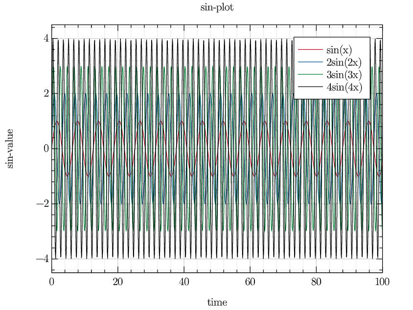

绘制`bessel`函数（贝塞尔函数）

~~~julia
using SpecialFunctions
x = collect(0:0.01:20)
legend("0 order", "1 order", "2 order", "3 order")
title("Bessel function")
xlim([0, 20])
ylim([-1, 1])
GR.plot(x, SpecialFunctions.besselj.(0, x),
        x, SpecialFunctions.besselj.(1, x),
        x, SpecialFunctions.besselj.(2, x),
        x, SpecialFunctions.besselj.(4, x))
~~~

绘制散点图

~~~julia
using GR
n = 500
x = rand(n)
y = rand(n)
xlim([0, 1])
ylim([0, 1])
title("scatter-plot")
xlabel("x")
ylabel("y")
GR.scatter(x, y)
~~~

### 科学计算绘图工具`Gadfly`

~~~julia
using Gadfly
Gadfly.plot(x = rand(10), y = rand(10))
~~~

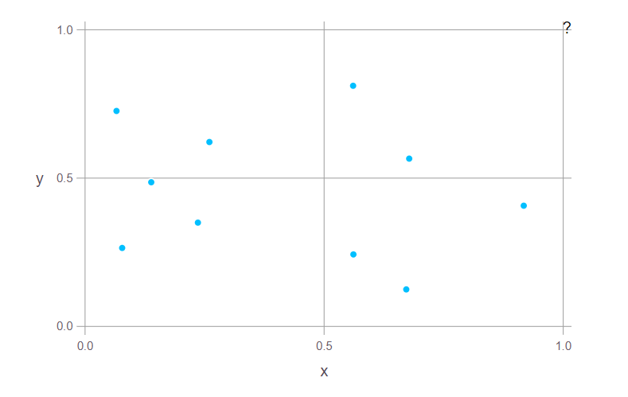

~~~julia
Gadfly.plot(x = rand(10), y = rand(10), Geom.point, Geom.line)
~~~

~~~julia
Gadfly.plot(x = 1:10, y = rand(10).^2, 
Scale.y_sqrt, Geom.point, Geom.smooth,
Guide.xlabel("stimulus"), Guide.ylabel("Response"), Guide.title("Dog Training"))
~~~

~~~julia
Gadfly.plot([sin, cos], 0, 25)
~~~

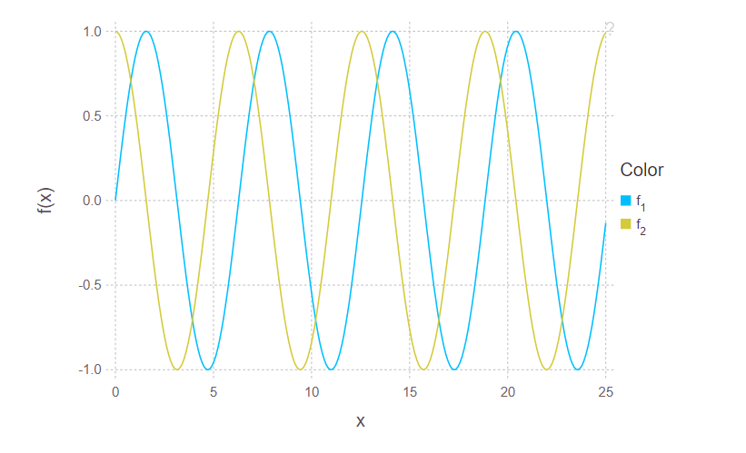

### `PyPlot`

#### 一维数据

~~~julia
using PyPlot
y = rand(20)
x = 1:20
PyPlot.plot(x, y, lw=2.0, linestyle="--")
PyPlot.grid(true)
PyPlot.axis("tight")
PyPlot.xlabel("index")
PyPlot.ylabel("value")
PyPlot.title("A simple plot1")
~~~

#### 多组数据

~~~julia
y = rand(20, 2)
x = 1:20
PyPlot.plot(x, y[:,1], lw=2.0, label="1st", color="r", linestyle="--")
PyPlot.plot(x, y[:,2], lw=1.5, label="2nd", color="b", linestyle="-")
PyPlot.grid(true)
PyPlot.legend(loc=0)
PyPlot.axis("tight")
PyPlot.xlabel("index")
PyPlot.ylabel("value")
PyPlot.title("A simple plot2")
~~~

#### 多个子图

~~~julia
y = rand(20, 2)
x = 1:20
PyPlot.subplot(211)
PyPlot.plot(x, y[:,1], lw=2.0, label="1st", color="r", linestyle="--")
PyPlot.grid(true)
PyPlot.axis("tight")
PyPlot.title("The first plot")
PyPlot.xlabel("index")
PyPlot.ylabel("value")
PyPlot.subplot(212)
PyPlot.plot(x, y[:,2], lw=1.5, label="2nd", color="b", linestyle="-")
PyPlot.grid(true)
PyPlot.axis("tight")
PyPlot.xlabel("index")
PyPlot.ylabel("value")
PyPlot.title("The second plot")
~~~

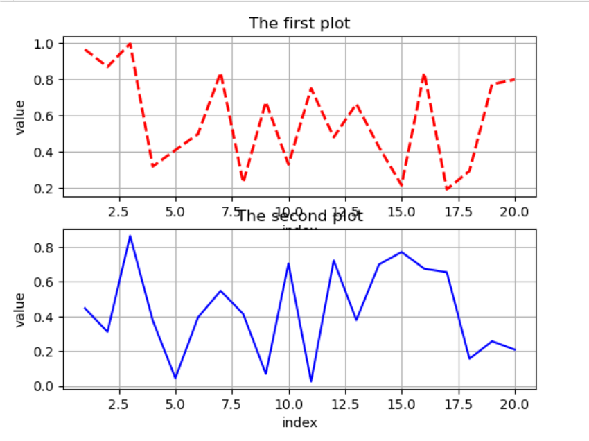

#### 箱线图

~~~julia
y = rand(10, 4)
PyPlot.boxplot(y)
PyPlot.xlabel("x")
PyPlot.ylabel("y")
PyPlot.title("boxplot")
~~~

## IO操作

### 读文件操作

~~~julia
s1 = readlines("1.txt")
# println(s1)

s2 = open("1.txt", "r")
line = readline(s2)
println(eof(s2)) #检验文件是否到达了末尾 >>false
println(line)    #刚烈女子
println(length(line))#查看字符串长度  >>4 
println(sizeof(line))#查看字符串字节数   >>12
println(position(s2))#返回字节数所在位置  >>14
println(read(s2, Char)) #向下读取一个字符  >>原
line = readline(s2)
println(line)      #>>唱：锦零
println(read(s2, Int8))  #读取下一个字符的ASCII值
close(s2)              #关闭文件
~~~

`1.txt`中的内容为：

~~~
刚烈女子
原唱：锦零
翻唱：大柯
mix：杀鬼
作曲 : 殇小谨
我所爱的 一笔就带过
我经历着 一生都坎坷
我藏着 心上最落寞
踉跄着想反驳
我未曾求而不得
我要高歌 是世俗误我
我求解脱 沉塘来附和
我唱着 知交在闺阁
将哀怨都描摹
泪满春衫更单薄
断肠写到第几次
又乱了几分心思
我手中笔纸
诉不尽往事
我从前也曾如赤子
天真烂漫知
婚后改姓氏 纲常作谈资
敢与朱夫子 庭院前对峙
那一种日子
最像我爱的样子
可惜每个刚烈女子
抗不过俗世
女诫告知礼教说辞
那个朝代所谓爱情都奢侈
写个故事 说给后世
我要高歌 是世俗误我
我求解脱 沉塘来附和
我唱着 知交在闺阁
将哀怨都描摹
泪满春衫更单薄
断肠写到第几次
又乱了几分心思
我手中笔纸
诉不尽往事
我从前也曾如赤子
天真烂漫知
婚后改姓氏 纲常作谈资
敢与朱夫子 庭院前对峙
那一种日子
最像我爱的样子
可惜每个刚烈女子
抗不过俗世
女诫告知礼教说辞
那个朝代所谓爱情都奢侈
写个故事 说给后世
我形容落日像最后的武士
像最后的武士
摆着个沧桑的姿势
我经历多少世事我还固执
我从前也曾如赤子
天真烂漫知
婚后改姓氏 纲常作谈资
敢与朱夫子 庭院前对峙
那一种日子
最像我爱的样子
可惜每个刚烈女子
抗不过俗世
女诫告知礼教说辞
那个朝代所谓爱情都奢侈
写个故事 说给后世
~~~

在`open`函数中，可以直接调用函数

~~~julia
line = open(readline, "1.txt")
println(line)
>> 刚烈女子
~~~

当然，也可以调用自定义函数：

~~~julia
readFunc(s::IOStream) = read(s, Char)
char = open(readFunc, "1.txt")
println(char)
>> 刚
~~~

还可以像`Python`中的`with open...as`的用法一样打开文件

~~~julia
open("1.txt", "r") do stream
    for line in eachline(stream)
        println(line)
    end
end
~~~

也可以将上述过程定义成函数再用`open`函数操作

~~~julia
function readFunc2(stream)
    for line in eachline(stream)
        println(line)
    end
end
lines = open(readFunc2, "1.txt")
println(lines)
~~~

### 写文件操作

~~~julia
write("2.txt", "Hello World")
open("2.txt", "w") do f
    for ch in 'a':'z'
        write(f, ch)
    end
    write(f, '\n')
end
>>abcdefghijklmnopqrstuvwxyz
~~~

`open`函数的参数模式定义如下：

| Mode | Description                        |
| ---- | ---------------------------------- |
| `r`  | `read`                             |
| `w`  | `write`,`create`,`truncate`        |
| `a`  | `write`,`create`,`append`          |
| `r+` | `read,write`                       |
| `w+` | `read`,`write`,`create`,`truncate` |
| `a+` | `read`,`write`,`create`,`append`   |

~~~julia
io = open("3.txt", "w")
write(io, "Hello Julia!")
~~~

但这种读写文件的方式对矩阵操作支持不太好

~~~julia
mat = reshape(1:9, (3, 3))
write("mat.txt", mat)
#在我的操作环境下会乱码
~~~

最好用`DelimitedFiles`包进行矩阵的读写操作

~~~julia
using DelimitedFiles
m = reshape(1:9, (3, 3))
writedlm("number.txt", m, '\t')
cont = readdlm("number.txt")
println(cont)
>> [1.0 4.0 7.0; 2.0 5.0 8.0; 3.0 6.0 9.0]
#读入的结果由整型变成了浮点型，如果想要读入整型，只需要readdlm("number.txt", Int8)
~~~

写入结果：

~~~
1	4	7
2	5	8
3	6	9
~~~

除了`txt`格式外，`Julia`还可以操作`csv`等格式，但`Julia`自带的数据序列化工具`JLD2`速度更快，跨平台，重点推荐。

### `CSV`文件

写`csv`文件与操作普通文件类似，中间加个逗号就可以了。

~~~julia
using DelimitedFiles
data = rand(Int8, 10, 15)
writedlm("1.csv", data, )
~~~

读取：

~~~julia
using DelimitedFiles
df = readdlm("1.csv")
println(df)
>>Any["123,41,-49,111,120,-126,-59,-112,58,95,98,88,92,-111,115"; "74,82,-13,72,101,16,114,-123,23,-5,-108,63,-88,33,5"; "-81,77,-9,37,-77,-45,-115,-94,28,-11,12,101,50,100,83"; "-76,5,-107,-93,66,49,111,7,22,-59,110,72,-53,-126,46"; "95,100,5,64,4,-125,-26,-44,121,-23,-96,-83,-84,52,-46"; "-3,-88,120,-71,-116,-29,60,43,80,-38,69,-74,18,17,-35"; "107,-107,10,11,-48,-87,46,108,-74,-12,96,-107,-100,-10,82"; "-97,-17,72,100,-94,82,36,-64,22,-88,99,64,-111,-15,-62"; "-67,-109,108,91,125,124,-3,-49,-97,48,-29,20,87,64,-70"; "8,-47,126,-93,-90,42,-116,-47,-26,-44,77,-105,-72,-56,32"]
#读入的格式为字符串
~~~

也可以使用`CSV`包中自带的函数读取

~~~julia
using CSV
df1 = CSV.read("1.csv")
println(df1)
#读入的为dataframe格式
~~~

### JLD2

JLD2是JLD格式的改进，也是一种[HDF5](https://zhuanlan.zhihu.com/p/104145585?utm_source=wechat_session)格式

写文件

~~~julia
using JLD2
stri = "Hello Julia"
fid = jldopen("jld_test.jld2", "w")
write(fid, "stri", stri)
close(fid)
~~~

读文件

~~~julia
using JLD2
fid = jldopen("jld_test.jld2", "r")
res = read(fid, "stri")
println(res)
close(fid)
>>Hello Julia
~~~

### IOBuffer

相当于在内存中创建一个`IOStream`

~~~julia
io = IOBuffer()
write(io, "Hello World!", "JuliaLang is great!")
~~~

采用`take!`的方式将内容从`IOBuffer`中读出

~~~julia
println(String(take!(io)))
>>Hello Julia
>>Hello World!JuliaLang is great!
~~~

如果在创建`IOBuffer`时就指定了里面的内容，则`IOBuffer`为只读的。

~~~julia
io = IOBuffer("Hello World!")
write(io, "This is not writable") # error
read(io, String)
~~~

关闭`IOBuffer`

~~~julia
close(io)
~~~

## 模块

模块是一些互相隔离的工作空间，用法类似于`Python`中导入库时，使用`import * as *`的方法，在`Julia`中，采用`using`或`import`导入要使用的模块。

我们的模块内容如下

~~~julia
module my

export my_square, my_abs

#square function
my_square(x::Int64) = x*x

#abs function
my_abs(x) = (x>0) ? x : -x

#add function
my_add(x,y) = x + y

#minus function
my_minus(x, y) = x - y

#multiply function
my_multiply(x, y) = x*y

end
~~~

在程序中直接调用时会显示找不到模块。这是因为`julia`中并未找到该` Module`的位置，我们可以手动添加进来，在程序的最开始，加上`push!(LOAD_PATH,".")`，`"."`表示当前工作目录，也可以把。换成绝对目录也可以先用` cd dir`的命令切換到我们的 `Module`的目录，再直接使用`push!(LOAD_PATH,".")`,这样就可以正确的调用 `Mymodule`了。
 如果不想在程序中写出来，也可以在`~/. julia/ config/ startup.jl`文件中写明，该文件指明了程序运行时需要执行哪些操作在 Windows中，`~`指的是`c: \User \Username`目录；`MAC`的`~`指的是` User \Username`目录。
` My Moduler`中的` export`是将这两个函数导出来，这样就可以直接使用`my_ square`和`my_abs`函数，而不必非要使用`Mymodule.my_ square`和 `My Module.my_abs`调用模块的代码如下:

~~~julia
push!(LOAD_PATH,".")
using  my
using my:my_add, my_multiply
res1 = my.my_square(3)
res2 = my_square(3)
res3 = my_abs(-4)
res4 = my_add(3,4)
res5 = my.my_minus(4,3)
res6 = my_minus(4,3)#error
~~~

我们还可以使用 `import Mymodule`语句，基本用法相同，如果申明了 `export`就可以不用加模块名，没声明的话要加模块名，不同的地方在于 `using` 用于将另一个模块带入当前模块的名称空间 .   `import` 用于将特定类型/函数/变量从其他模块引入当前模块的名称空间 。`ps:不是很明白`。两种方式都可以给函数添加新的方法。

### 模块和文件

模块和文件并没有关系，一个模块可以有多个文件，一个文件也可以有多个模块。

##### 一个模块多个文件

~~~julia
module MyModu
include("file1.jl")
include("file2.jl")
end
~~~

##### 一个文件多个模块

~~~julia
module Test1
include("file1.jl")
end

module Test2
include("file2.jl")
end
~~~

### 标准模块

有三个非常重要的准模块：`Main`,`Core`和`Base`

+ `Main`是最顶层的模块， Julia启动后会将`Main`设置为当前模块。在提示符下定义的变量会进入到`Main`，执行 `varinfo()`会列出`Main`中的变量。
+ `core`包含所有语言内置的标识符（语言的核心部分，不是库），每个模块都默认声明了 `using Core`（否则的话啥也做不）。
+ `Base`模块包含了ー些基本的功能（即源码中`base`/目录下的内容）。所有模块都默认包含了` using Base`，因为对大多数库来说，都会用到。

## 元编程

### 什么是元编程

#### 维基百科上的解释为：

元编程（英语： Metaprogramming),又译超编程，是指某类计算机程序的编写，这类计算机程序编写或者操纵其它程序（或者自身）作为它们的资料，或者在运行时完成部分本应在编译时完成的工作。多数情况下，与手工编写全部代码相比，程序员可以获得更高的工作效率，或者给程序更大的灵活度去处理新的情形而无需重新编译。

是不是没看懂？没关系，因为我刚开始也没看懂。知乎上有一个关于元编程的解释是比较直观的。

#### 知乎原回答

Meta-这个前缀在希腊语中的本意是「在后，越过，的」,类似于拉丁语的post-,比如 metaphysics就是「在物理学之后」,这个词最开始指一些亚里士多德的著作，因为它们通常排序在《物理学》之后。但西方哲学界在几干年中渐渐斌予该词缀一种全新的意义：关于某事自身的某事。比如meta- knowledge就是「关于知识本身的知识」,meta-data就是「关于数据的数据」,meta- language就是「关于语言的语言」,而meta- programming也是由此而来，是「关于编程的编程」。弄清了词源和字面意思，可知大陆将meta-这个前缀译为「元」并不恰当。台湾译为「后设」,稍微好一点点，但仍日无法望文生义。也许「自相关」是个不错的选择，「自相关数据」、「自相关语言」、「自相关编程」但是好像又太罗嗦了。 Anyway。先看看meta-data:「我的电话是+8612345678910」一这是条数据；「+8612345678910有十三个数字和个字符，前两位是国家代码，后面是个移动电话号码」一这是关于前面那条数据的数据。 那么照猫画虎，怎样才算meta- programming呢？泛泛来说，只要是与编程相关的编程就算是meta- programming了。比如，若编程甲可以输出A-Z，那么写程序甲算「编程」;而程序乙可以生成程序甲（也许还会连带着运行它输出A-Z),那么编写程序乙的活动，就可以算作meta- programming,「元编程」。

那我们看看Julia中的元编程到底是什么及如何应用？

### 程序表示

每个`Julia`程序都是以字符串开始的

~~~julia
julia> str1 = "1+1"
"1+1"
#将字符串解析成表达式
julia> ex1 = Meta.parse(str1)
:(1 + 1)
julia> typeof(ex1)
Expr
#我们也可以直接定义成parse的形式
julia> ex2 = :(1+1)
:(1 + 1)

julia> typeof(ex2)
Expr
~~~

`Expr`对象包含两个部分，一个标识表达式类型的`Symbol`，一个是表达式的参数

~~~julia
julia> fieldnames(typeof(ex1))
(:head, :args)

julia> ex1.head
:call

julia> ex1.args
3-element Array{Any,1}:
  :+
 1
 1

julia> Meta.show_sexpr(ex1)
(:call, :+, 1, 1)
~~~

所以我们可以用`prefix natation`来构造

~~~julia
julia> ex3 = Expr(:call, :+, 1, 1)
:(1 + 1)
~~~

当然我们也可以求出表达式的结果

~~~julia
julia> eval(ex3)
2
~~~

`dump`函数可以显示`Expr`对象

~~~julia
julia> dump(ex3)
Expr
  head: Symbol call
  args: Array{Any}((3,))
    1: Symbol +
    2: Int64 1
    3: Int64 1
~~~

### `Symbol`

构造一个`Symbol`

~~~julia
julia> :foo
:foo

julia> typeof(ans)
Symbol

julia> :foo ==  Symbol("foo")
true
~~~

`Symbol`中如果是多个参数，则表示将这些参数连起来

~~~julia
julia> Symbol("foo", 123)
:foo123
~~~

### `Quote`

我们前面定义的表达式都是数值表达式，元编程也允许字符表达式

~~~julia
julia> ex4 = :(a+b*c+1)
:(a + b * c + 1)

julia> typeof(ans)
Expr
~~~

如果是多行表达式，可以在`quote...end`中实现

~~~julia
julia> ex5 = quote
       x = 1
       y = 2
       z = 3
       end
quote
    #= REPL[27]:2 =#
    x = 1
    #= REPL[27]:3 =#
    y = 2
    #= REPL[27]:4 =#
    z = 3
end

julia> typeof(ex5)
Expr
~~~

可以使用`$`符号，把数值代入到符号表达式中

~~~julia
julia> a = 1
1

julia> ex = :($a + b)
:(1 + b)
~~~

如果是`array`的表达式，则要用如下形式

~~~julia
julia> args = [:x,:y,:z]
3-element Array{Symbol,1}:
 :x
 :y
 :z
julia> :(f(1,$(args...)))
:(f(1, x, y, z))
~~~

#### 嵌套`Quote`

~~~julia
julia> x = :(1+2)
:(1 + 2)

julia> e = quote quote $x end end
quote
    #= REPL[45]:1 =#
    $(Expr(:quote, quote
    #= REPL[45]:1 =#
    $(Expr(:$, :x))
end))
end
~~~

此时我们用`eval`查看此表达式结果

~~~julia
julia> eval(e)
quote
    #= REPL[65]:1 =#
    1 + 2
end
~~~

也就是说，该表达式内容仍然是一个`quote`；那我们如何提取出最里面的内容呢？

~~~julia
julia>  e = quote quote $$x end end
quote
    #= REPL[67]:1 =#
    $(Expr(:quote, quote
    #= REPL[67]:1 =#
    $(Expr(:$, :(1 + 2)))
end))
end

julia> eval(e)
quote
    #= REPL[67]:1 =#
    3
end
~~~

### 函数中的表达式

~~~julia
function math_expr(op, op1, op2)
    expr = Expr(:call, op, op1, op2)
    return expr
end
ex = math_expr(:+, 1, Expr(:call, :*, 4, 5))
println(ex) #:(1+4*5)
println(eval(ex)) #21
~~~

~~~julia
function make_expr2(op, opr1, opr2)
    opr1f, opr2f = map(x -> isa(x, Number) ? 2*x : x, (opr1,opr2))
    retexpr = Expr(:call, op, opr1f, opr2f)
end
ex1 = make_expr2(:+, 1, 2)
println(eval(ex1)) #6
ex2 = make_expr2(:+,1,Expr(:call, :*, 5, 8))
println(eval(ex2)) #42
~~~

### Macros

`Macro`也是`Julia`中元编程的一个重要应用，`Macro`是一种规则，或称为语法替换，这种替换是在预编译时进行，`Macro`在运行时没有像函数似的调用时间。

~~~julia
macro HelloWorld()
    return :(println("Hello World"))
end
~~~

编译器会把所有的`@HelloWorld`换成`:(println("Hello World"))`

~~~julia
@HelloWorld
>>Hello World
~~~

`Macro`也可以带参数

~~~julia
macro ILike(str)
    return :(println("I like ", $str))
end
@ILike("Julia")
>> I like Julia
~~~

我们可以用`macroexpand`看到返回的`quote`表达式，这也是宏调试时一个非常重要的工具。

~~~julia
ex = macroexpand(Main, :(@ILike("Julia")))
println(ex)
println(typeof(ex))
>> :(Main.println("I like ", "Julia"))
>> Expr
~~~

也可以用`@macroexpand`查看返回的`quote`表达式

~~~julia
println(@macroexpand @ILike "Julia")
>> :(Main.println("I like ", "Julia"))
~~~

`@macroexpand`还有一个重要用途，我们看下面例子

~~~julia
macro testExpend(arg)
    println("I execute at parse time. The argument is:", arg)
    return :(println("I execute at runtime. The argument is:", $arg))
end
~~~

两个`println`函数，一个是`Julai`语句，一个表达式，如果我们直接运行`@testExpend((1,2))`

~~~julia
@testExpend((1,2,3))
>> I execute at parse time. The argument is:(1, 2, 3)
>> I execute at runtime. The argument is:(1, 2, 3)
~~~

两个`println`语句都有输出；如果我们定义一个表达式

~~~julia
ex = macroexpand(Main, :(@testExpend (1,2,3)))
>> I execute at parse time. The argument is:(1, 2, 3)
~~~

可以看出，当表达式被定义时，第一个`println`的内容就打印出来了

~~~julia
eval(ex)
>> I execute at parse time. The argument is:(1, 2, 3)
>> I execute at runtime. The argument is:(1, 2, 3)
~~~

而第二个`println`函数则在表达式被运行才执行

#### 宏调用

前面我们也调用`Macro`，比如`@ILike("Julia")`，但宏调用的语法是很有讲究的，下面我们来具体说一下，两种常用的宏调用方式

~~~julia
@name expr1 expr2...
@name(expr1, expr2,...)
~~~

需要注意的是：第一种用法两个参数之间是空格隔开，且参数之间没有逗号；第二种用法的`name`和`()`之间是没有空格的，且参数之间有逗号隔开。

如果写成了

~~~julia
@name (expr1, expr2, ....)
~~~

则表示参数为一个`tuple`

当调用`array`时，可采用如下的方式

~~~julia
@name[a b] * v
@name([a b]) * v
~~~

注意和下面的区别，上面表示数组做`[a b]`参数调用宏然后乘以`v `，下面的表示数组`[a b]`先和`v`相乘，结果作为宏的参数：

~~~julia
@name [a b] * v
~~~

对于`Macro`的参数，我们可以用`show`打印出来

~~~julia
macro showarg(x)
    show(x)
end
@showarg(a)
@showarg(1+1)
>> :a
>> :(1+1)
~~~

每个 `Macro`都会被传入两个额外的参数： `__source__`和、 `__module__,`他们可以指示出 `location`，在调试的时候很有用处。由于`Julia`是多重派发的， `Macro`也支持类似于函数样的多种方法。下面我们来看一个用 `Macro`调试的例子。

~~~julia
debuggging = true

macro debug1(msg...)
    if debuggging
        :(println("DEBUG>", $(msg...)))
    else
        :nothing
    end
end

macro debug1(lineno, msg...)
    if debuggging
        :(println("DEBUG", basename(@__FILE__),":",$lineno,">",$(msg...)))#basename(@__FILE__)打印出调用宏的文件名字
    else
        :nothing
    end
end

function bubble_sort!(xs::Vector)
    println("Bubble_sort starting...")
    n = length(xs)
    swapped = true
    while swapped
        swapped = false
        for i in 1:n-1
            if xs[i] > xs[i+1]
                xs[i+1], xs[i] = xs[i], xs[i+1]
                @debug1(@__LINE__, join(xs, " ")) #@__LINE__返回所在行号
                swapped = true
            end
        end
    end
    xs
end

xs = Vector([1,3,4,5,8,2,7])
res = bubble_sort!(xs)
~~~

运行结果为：

~~~julia
Bubble_sort starting...
DEBUG元编程.jl:73>1 3 4 5 2 8 7
DEBUG元编程.jl:73>1 3 4 5 2 7 8
DEBUG元编程.jl:73>1 3 4 2 5 7 8
DEBUG元编程.jl:73>1 3 2 4 5 7 8
DEBUG元编程.jl:73>1 2 3 4 5 7 8
~~~

#### 常用的宏

+ `@time`：返回程序运行所需时间
+ `@show`：将执行内容和结果都打印出来
+ `@which`：返回在哪个地方调用的当前语句

##### `@time`

~~~julia
@time 1 + 2
@time println("Hello world!")
@time sleep(1)
~~~

`@time`就是用下面方法实现的

~~~julia
macro tid(expre)
    quote
        local t0 = time()
        local val = $exper
        elapsedtime = time() - t0
        println("$elapsedtime seconds")
        val
    end
end
@tid map(x->x^2, 1:10000)
~~~

##### `@which`

~~~julia
@which 1 + 2
@which sleep(2)
~~~

##### `show`

~~~julia
x = rand(10)
@show sum(x)
@show cumsum(x)
~~~

## 并行运算

### 协程

协程是一张轻量级的线程，通过`Channel`实现多个任务之间的通信。

`Channel`可以看作是一个管道，一端可读，一端可写。

+ 不同的`task`可以通过`put!`往同一个`channel`中并发地写入
+ 不同的`task`也可以通过`take!`从同一个`channel`并发地取数据

`Channel`的定义方式

~~~julia
 Channel{T=Any}(func::Function, size=0; taskref=nothing, spawn=false)
# 从函数func中创建一个任务，其大小为size
#如果需要对创建的任务的引用，则通过关键字参数传递Ref{task}对象taskref。
#如果spawn = true，为func创建的任务可能被并行调度到另一个线程上，相当于通过thread .@spawn创建一个任务。
~~~

~~~julia
c1 = Channel(32)
c2 = Channel{Float64}(32)
put!(c1, 1)
put!(c2, 2)
println(take!(c2)) 
>> 2.0
#自动将我们输入的整型转化为了浮点型
~~~

关闭`Channel`，关闭后不能写入。

~~~julia
julia> close(c1)                                           
                                                           
julia> put!(c1,3)                                          
ERROR: InvalidStateException("Channel is closed.", :closed)
~~~

但是可以读出，`fetch`只能读第一个数据，但不会把数据从`Channel`中删除，但`take!`会读出后删除。

~~~julia
julia> fetch(c1)   
1                  
                   
julia> take!(c1)   
1                  
~~~

+ 如果一个`Channel`是空的，读取的`take!`(即执行`take`的`task`)会被阻塞直到有新的数据被准备好了。

+ 如果一个`Channel`是满的，那么写入的`task`(即执行`put!`的`task`)会被阻塞，直到`Channel`有空余。

+ `isready`可以用来检查一个`Channel`中是否有已经准备好的元素，而等待一个元素准备好则用`wait`

  ~~~julia
  julia> c2 = Channel(32)          
  Channel{Any}(sz_max:32,sz_curr:0)
                                   
  julia> isready(c2)               
  false                            
                                   
  julia> wait(c2)   #会堵塞直到有新数据         
  ~~~

+ 一个`Channel`一开始处于开启状态，也就是说可以被`take!`读取和`put!`写入。`close`会关闭一个`Channel`，对于一个已经关闭的`Channel`，`put!`会失败。

`Channel`可以在`for`循环中遍历。此时，循环会一直运行直到`Channel`中有数据，遍历过程中会取遍加入到`Channel`中的所有值，一旦`Channel`关闭或者取空了，`for`循环就此停止。

~~~julia
julia> c = Channel{Int}(10)        
Channel{Int64}(sz_max:10,sz_curr:0)
julia> foreach(i->put!(c,i),1:3) #运用foreach函数将1~3写入c
~~~

如果此时我们直接用`for`去遍历`c`中的内容，则在读取完后会一直等待`Channel`中有新的数据进来，如果用`REPL`运行，则会停在那里。

~~~julia
data = [i for i in c]
~~~

如果我们先把`Channel`关闭，再用`for`去遍历，则会读出`Channel`中的内容，因为此时`c`已经关闭，`for`不会再等待写入了。

~~~julia
close(c)
data = [i for i in c]
~~~

用`Channel`完成多任务之间的数据交互

新建两个`Channel`，一个是`int`型，一个是`Tuple`型，对于每个任务，延时一段时间后，开始执行该任务的内容，并将结果放到`result`中。

~~~julia
const jobs = Channel{Int}(32) #const声明值不会变的全局变量
const results = Channel{Tuple}(32)
function do_work()
    for job_id in jobs
        exec_time = rand()
        sleep(exec_time)
        put!(results, (job_id, exec_time))
    end
end
~~~

向`jobs`中放入数据

~~~julia
function make_jobs(n)
    for i in 1:n
        put!(jobs, i)
    end
end
~~~

写入$12$个数据

~~~julia
n = 12
@async make_jobs(n)
~~~

`@async`表示把后面的表达式放到`Task`里，并加入到程序的执行列表中。

开四个任务来处理

~~~julia
for i in 1:4
    @async do_work()
end
~~~

取出四个任务的执行结果

~~~julia
@elapsed while n>0 #一个对表达式求值的宏，丢弃结果值，而不是返回作为浮点数执行所需的秒数。
    job_id, exec_time = take!(results)
    println("$job_id finished in $(round(exec_time, digits=2)) seconds")
    global n = n - 1
end
>>3 finished in 0.2 seconds
4 finished in 0.38 seconds
1 finished in 0.49 seconds
5 finished in 0.54 seconds
2 finished in 0.75 seconds
8 finished in 0.04 seconds
10 finished in 0.07 seconds
7 finished in 0.5 seconds
9 finished in 0.3 seconds
6 finished in 0.99 seconds
11 finished in 0.61 seconds
12 finished in 0.68 seconds
~~~

### 多线程

要用到`Threads`模块，`Threads`是`Base`的一个模块，程序是默认`using Base`的，因此`Threads`可以直接使用在`REPL`上查看当前的线程数，默认是启动一个线程。使用`Threads.nthreads()`来查看线程数，使用`Threads.threadid()`来查看当前线程`id`。

使用`export JULIA_NUM_THREADS=4(Linux OSX)`或`set JULIA_NUM_THREADS=4(Windows)`来设置启动4个线程。

我们查看$10$次线程的`id`

~~~julia
a = zeros(Int64,10);
#一个宏，用于并行地运行一个for循环。这会生成nthreads()线程数，在它们之间分割迭代空间，并并行迭代。在循环的末尾放置一个屏障，它等待所有线程完成执行，然后循环返回。
Threads.@threads for i = 1:10
a[i] = Threads.threadid()    
end                          
julia> a                   
10-element Array{Int64,1}: 
 1                         
 1                         
 1                         
 2                         
 2                         
 2                         
 3                         
 3                         
 4                         
 4                         
~~~

#### 原子操作

所谓的原子操作是指不会被线程调度机制打断的操作；这种操作一旦开始，就一直运行到结束，中间不会有任何`context switch`(切换到另一个线程)。

我们先看一个使用多线程但不使用原子操作的例子。

~~~julia
using Base.Threads #直接使用Threads中的函数
nthreads()
acc = Ref(0) #创建对0的引用，相当于创建了一指向0的指针，acc本身为一个指针，acc[]为指针指向的值
@threads for i in 1:1000 
    acc[]+=1
end
println(acc[])
>> 264
~~~

这是因为线程1对`acc`操作时，先取到它的数据为`x`，此时可能线程2也在取它的值，取到的也是`x`，所以两个线程分别对其加1，结果时`x+1`，而不是`x+2`，这就是线程之间没有做到同步机制。

如果使用了原子操作，则当前线程在对`acc`进行操作时，别的线程是不能操作的，只能等`acc+1`之后才能再对它进行操作。

~~~julia
acc = Atomic{Int64}(0)
@threads for i  in 1:1000
    atomic_add!(acc,1)
end
println(acc[])
>> 1000
~~~

### 多进程

多进程也叫多核心或者分布式处理，就是用一个CPU的多个核心或者多个CPU进行编程。

`Julia`中的分布式编程基于两个基本概念：远程引用（ `remote references`）和远程调用（ `remote call`),远程引用是一个对象，任意一个进程可以通过它访问存在某个特定进程上的对象。远程调用指是某个进程发起的执行函数的请求，该函数会在另一个（也可能是同一个）进程中执行。

远程引用有两种类型： `Future`和 `Remotechannel`。

 一次远程调用会返回一个 Future作为结果。远程调用会立即返回；也就是说，执行远程调用的进程接下来会继续执行下 一个操作，而远程调用则会在另外的进程中进行。你可以通过对返回的 `Future`进行`wait`操作来等待远程调用结束，然后用 `fetch`获取结果。
 对于`Remotechannel`而言，它可以被反复写入，例如，多个进程可以通过引用同一个远程 `Channel`来协调相互之间的操作。

每个进程都有一个对应的`id`，提供`Julia`交互环境的进程的`id`永远是1,我们把用来执行并行任务的进程称为` worker`。假如总共只有一个进程，那么进程1就被认为`worker`，否则，除了进程1以外的进程都称作 `worker`。

` REPL`上多进程使用方式，在`Julia`的可执行文件的路径下打开命令行，执行`julia-p n`，就是启动`n`个进程的`julia`。

~~~julia
# 指定进程2来生成一个3✖4的随机矩阵
r = remotecall(rand, 2, 3, 4)
# 在进程2中计算
s = @spawnat 2 1 .+ fetch(r)  #@spawnat 2指在进程2中运行,fetch是把r中的数据获取到当前进程中
# 取得s
fetch(s)
>>
3×4 Array{Float64,2}:              
 1.2672   1.12504  1.38571  1.80812
 1.15732  1.31485  1.8834   1.75521
 1.77022  1.64711  1.88362  1.47821
~~~

也可以让`Julia`自行指定进程

~~~julia
r = @spawn rand(2,2)
s = @spawn 1 .+ fetch(r)
fetch(s)
~~~

要想让代码并行执行，需要对所有进程可见

~~~julia
function f1(a,b)
    a + b
end
~~~

~~~julia
fetch(@spawn f1(2,3))
>> error
~~~

这是因为`f1()`只对进程1可见，别的进程看不见。`f1()`是在进程1中定义的，因为其他进程不可见，但`rand`是在`Base`中，其他进程都可见。

为了让`f1()`在所有进程中都可见，可以使用`@everywhere`宏定义`f1()`

~~~julia
julia> @everywhere f2(a,b) = a + b  
                                    
julia> fetch(@spawn f2(2,3))        
5                                   
~~~

## 科学计算

### 科学计算必备`DataFrames`

#### `DataFrames`基本操作

新建一个`DataFrame`并添加4列内容

~~~julia
using DataFrames
df1 = DataFrame()
df1[!, "clo1"] = Array([1.0,2.0,3.0])
df1[!, "clo2"] = Array([4.0,5.0,6.0])
df1[!, "clo3"] = Array([7.0,8.0,9.0])
df1[!, "ID"] = Array(['a','b','c'])
show(df1)
3×4 DataFrame                               
│ Row │ clo1    │ clo2    │ clo3    │ ID   │
│     │ Float64 │ Float64 │ Float64 │ Char │
├─────┼─────────┼─────────┼─────────┼──────┤
│ 1   │ 1.0     │ 4.0     │ 7.0     │ 'a'  │
│ 2   │ 2.0     │ 5.0     │ 8.0     │ 'b'  │
│ 3   │ 3.0     │ 6.0     │ 9.0     │ 'c'  │
                                            
~~~

如果没有指定列名。默认的列名为`x1、x2、x3...`。

~~~julia
df2 = DataFrame([collect(1:3),collect(4:6)], ["A","B"])
3×2 DataFrame           
│ Row │ A     │ B     │ 
│     │ Int64 │ Int64 │ 
├─────┼───────┼───────┤ 
│ 1   │ 1     │ 4     │ 
│ 2   │ 2     │ 5     │ 
│ 3   │ 3     │ 6     │ 
~~~

##### `DataFrame`合并

~~~julia
df2 = DataFrame()  
df2[!, "clo11"] = Array([11.0, 12.0, 13.0])
df2[!, "col12"] = Array([14.0, 15.0, 16.0])
df2[!, "col13"] = Array([17.0, 18.0, 19.0])
df2[!, "ID"] = Array(['a', 'b', 'c'])

join(df1, df2, on="ID")
3×7 DataFrame                                                             
│ Row │ clo1    │ clo2    │ clo3    │ ID   │ clo11   │ col12   │ col13   │
│     │ Float64 │ Float64 │ Float64 │ Char │ Float64 │ Float64 │ Float64 │
├─────┼─────────┼─────────┼─────────┼──────┼─────────┼─────────┼─────────┤
│ 1   │ 1.0     │ 4.0     │ 7.0     │ 'a'  │ 11.0    │ 14.0    │ 17.0    │
│ 2   │ 2.0     │ 5.0     │ 8.0     │ 'b'  │ 12.0    │ 15.0    │ 18.0    │
│ 3   │ 3.0     │ 6.0     │ 9.0     │ 'c'  │ 13.0    │ 16.0    │ 19.0    │
~~~

##### 改变列名

~~~julia
julia> rename(df1, :clo1 => :cloo1)         
3×4 DataFrame                               
│ Row │ cloo1   │ clo2    │ clo3    │ ID   │
│     │ Float64 │ Float64 │ Float64 │ Char │
├─────┼─────────┼─────────┼─────────┼──────┤
│ 1   │ 1.0     │ 4.0     │ 7.0     │ 'a'  │
│ 2   │ 2.0     │ 5.0     │ 8.0     │ 'b'  │
│ 3   │ 3.0     │ 6.0     │ 9.0     │ 'c'  │
                                            
~~~

##### 索引

~~~julia
df = DataFrame(rand(5,6))
# 索引第2至4列
 df[:,2:4]
5×3 DataFrame                             
│ Row │ x2       │ x3        │ x4       │ 
│     │ Float64  │ Float64   │ Float64  │ 
├─────┼──────────┼───────────┼──────────┤ 
│ 1   │ 0.131967 │ 0.550392  │ 0.371581 │ 
│ 2   │ 0.154318 │ 0.0976529 │ 0.297676 │ 
│ 3   │ 0.791917 │ 0.0435666 │ 0.258258 │ 
│ 4   │ 0.798479 │ 0.358984  │ 0.175848 │ 
│ 5   │ 0.978465 │ 0.695321  │ 0.687738 │ 

#索引第2到4行
3×6 DataFrame                                                              
│ Row │ x1       │ x2       │ x3        │ x4       │ x5       │ x6       │ 
│     │ Float64  │ Float64  │ Float64   │ Float64  │ Float64  │ Float64  │ 
├─────┼──────────┼──────────┼───────────┼──────────┼──────────┼──────────┤ 
│ 1   │ 0.845814 │ 0.154318 │ 0.0976529 │ 0.297676 │ 0.393848 │ 0.735145 │ 
│ 2   │ 0.858742 │ 0.791917 │ 0.0435666 │ 0.258258 │ 0.892454 │ 0.90762  │ 
│ 3   │ 0.17023  │ 0.798479 │ 0.358984  │ 0.175848 │ 0.932429 │ 0.460362 │ 
                                                                         # 行和列一起索引
df[2:4,["x1","x2"]]
3×2 DataFrame                 
│ Row │ x1       │ x2       │ 
│     │ Float64  │ Float64  │ 
├─────┼──────────┼──────────┤ 
│ 1   │ 0.845814 │ 0.154318 │ 
│ 2   │ 0.858742 │ 0.791917 │ 
│ 3   │ 0.17023  │ 0.798479 │ 

df.x1
5-element Array{Float64,1}:
 0.1425847262412432
 0.8458140032785422
 0.8587421782790019
 0.1702298485382867
 0.5077653777157061

for row in eachrow(df)  
	println(row)            
end   
DataFrameRow                                                               
│ Row │ x1       │ x2       │ x3       │ x4       │ x5        │ x6       │ 
│     │ Float64  │ Float64  │ Float64  │ Float64  │ Float64   │ Float64  │ 
├─────┼──────────┼──────────┼──────────┼──────────┼───────────┼──────────┤ 
│ 1   │ 0.142585 │ 0.131967 │ 0.550392 │ 0.371581 │ 0.0530827 │ 0.520608 │ 
DataFrameRow                                                               
│ Row │ x1       │ x2       │ x3        │ x4       │ x5       │ x6       │ 
│     │ Float64  │ Float64  │ Float64   │ Float64  │ Float64  │ Float64  │ 
├─────┼──────────┼──────────┼───────────┼──────────┼──────────┼──────────┤ 
│ 2   │ 0.845814 │ 0.154318 │ 0.0976529 │ 0.297676 │ 0.393848 │ 0.735145 │ 
DataFrameRow                                                               
│ Row │ x1       │ x2       │ x3        │ x4       │ x5       │ x6      │  
│     │ Float64  │ Float64  │ Float64   │ Float64  │ Float64  │ Float64 │  
├─────┼──────────┼──────────┼───────────┼──────────┼──────────┼─────────┤  
│ 3   │ 0.858742 │ 0.791917 │ 0.0435666 │ 0.258258 │ 0.892454 │ 0.90762 │  
DataFrameRow                                                               
│ Row │ x1      │ x2       │ x3       │ x4       │ x5       │ x6       │   
│     │ Float64 │ Float64  │ Float64  │ Float64  │ Float64  │ Float64  │   
├─────┼─────────┼──────────┼──────────┼──────────┼──────────┼──────────┤   
│ 4   │ 0.17023 │ 0.798479 │ 0.358984 │ 0.175848 │ 0.932429 │ 0.460362 │   
DataFrameRow                                                               
│ Row │ x1       │ x2       │ x3       │ x4       │ x5       │ x6       │  
│     │ Float64  │ Float64  │ Float64  │ Float64  │ Float64  │ Float64  │  
├─────┼──────────┼──────────┼──────────┼──────────┼──────────┼──────────┤  
│ 5   │ 0.507765 │ 0.978465 │ 0.695321 │ 0.687738 │ 0.791768 │ 0.682846 │  
                                                                         describe(df)
6×8 DataFrame                                                                                   
│ Row │ variable │ mean     │ min       │ median   │ max      │ nunique │ nmissing │ eltype   │ 
│     │ Symbol   │ Float64  │ Float64   │ Float64  │ Float64  │ Nothing │ Nothing  │ DataType │ 
├─────┼──────────┼──────────┼───────────┼──────────┼──────────┼─────────┼──────────┼──────────┤ 
│ 1   │ x1       │ 0.505027 │ 0.142585  │ 0.507765 │ 0.858742 │         │          │ Float64  │ 
│ 2   │ x2       │ 0.571029 │ 0.131967  │ 0.791917 │ 0.978465 │         │          │ Float64  │ 
│ 3   │ x3       │ 0.349183 │ 0.0435666 │ 0.358984 │ 0.695321 │         │          │ Float64  │ 
│ 4   │ x4       │ 0.35822  │ 0.175848  │ 0.297676 │ 0.687738 │         │          │ Float64  │ 
│ 5   │ x5       │ 0.612716 │ 0.0530827 │ 0.791768 │ 0.932429 │         │          │ Float64  │ 
│ 6   │ x6       │ 0.661316 │ 0.460362  │ 0.682846 │ 0.90762  │         │          │ Float64  │ 

sort!(df, :x3)
5×6 DataFrame                                                              
│ Row │ x1       │ x2       │ x3        │ x4       │ x5        │ x6       │
│     │ Float64  │ Float64  │ Float64   │ Float64  │ Float64   │ Float64  │
├─────┼──────────┼──────────┼───────────┼──────────┼───────────┼──────────┤
│ 1   │ 0.858742 │ 0.791917 │ 0.0435666 │ 0.258258 │ 0.892454  │ 0.90762  │
│ 2   │ 0.845814 │ 0.154318 │ 0.0976529 │ 0.297676 │ 0.393848  │ 0.735145 │
│ 3   │ 0.17023  │ 0.798479 │ 0.358984  │ 0.175848 │ 0.932429  │ 0.460362 │
│ 4   │ 0.142585 │ 0.131967 │ 0.550392  │ 0.371581 │ 0.0530827 │ 0.520608 │
│ 5   │ 0.507765 │ 0.978465 │ 0.695321  │ 0.687738 │ 0.791768  │ 0.682846 │
sort!(df, :x3, rev=true)
5×6 DataFrame                                                              
│ Row │ x1       │ x2       │ x3        │ x4       │ x5        │ x6       │
│     │ Float64  │ Float64  │ Float64   │ Float64  │ Float64   │ Float64  │
├─────┼──────────┼──────────┼───────────┼──────────┼───────────┼──────────┤
│ 1   │ 0.507765 │ 0.978465 │ 0.695321  │ 0.687738 │ 0.791768  │ 0.682846 │
│ 2   │ 0.142585 │ 0.131967 │ 0.550392  │ 0.371581 │ 0.0530827 │ 0.520608 │
│ 3   │ 0.17023  │ 0.798479 │ 0.358984  │ 0.175848 │ 0.932429  │ 0.460362 │
│ 4   │ 0.845814 │ 0.154318 │ 0.0976529 │ 0.297676 │ 0.393848  │ 0.735145 │
│ 5   │ 0.858742 │ 0.791917 │ 0.0435666 │ 0.258258 │ 0.892454  │ 0.90762  │
                                                                        

~~~

##### 使用`CSV`模块读写数据框

~~~julia
using CSV
df = DataFrame(rand(5,6))
CSV.write("df123.csv",df)
CSV.read("df123.csv")
~~~

##### 宏操作

~~~julia
using DataFramesMeta
 @where(df, :x1 .> 0.4) #找出符合的元素
3×6 DataFrame                                                              
│ Row │ x1       │ x2       │ x3        │ x4       │ x5       │ x6       │ 
│     │ Float64  │ Float64  │ Float64   │ Float64  │ Float64  │ Float64  │ 
├─────┼──────────┼──────────┼───────────┼──────────┼──────────┼──────────┤ 
│ 1   │ 0.507765 │ 0.978465 │ 0.695321  │ 0.687738 │ 0.791768 │ 0.682846 │ 
│ 2   │ 0.845814 │ 0.154318 │ 0.0976529 │ 0.297676 │ 0.393848 │ 0.735145 │ 
│ 3   │ 0.858742 │ 0.791917 │ 0.0435666 │ 0.258258 │ 0.892454 │ 0.90762  │ 

@with(df, :x2 .+ 1) #对某些元素进行操作
5-element Array{Float64,1}:
 1.9784645262145224
 1.1319666567456443
 1.7984789978555888
 1.1543181560315237
 1.7919167960660878

@select(df, :x3) #选择某些元素
5×1 DataFrame       
│ Row │ x3        │ 
│     │ Float64   │ 
├─────┼───────────┤ 
│ 1   │ 0.695321  │ 
│ 2   │ 0.550392  │ 
│ 3   │ 0.358984  │ 
│ 4   │ 0.0976529 │ 
│ 5   │ 0.0435666 │ 
 
 @select(df, p = 2 * :x1, :x2)
5×2 DataFrame                
│ Row │ p        │ x2       │
│     │ Float64  │ Float64  │
├─────┼──────────┼──────────┤
│ 1   │ 1.01553  │ 0.978465 │
│ 2   │ 0.285169 │ 0.131967 │
│ 3   │ 0.34046  │ 0.798479 │
│ 4   │ 1.69163  │ 0.154318 │
│ 5   │ 1.71748  │ 0.791917 │
                             
~~~

### `RDataSets`和`Gadfly`

`RDatasets`是`Julia`中的一个数据集，里面包含了很多可以学习和验证的数据，其中就包括`iris`数据集。

~~~julia
using RDatasets
iris = dataset("datasets", "iris")
150×5 DataFrame                                                           
│ Row │ SepalLength │ SepalWidth │ PetalLength │ PetalWidth │ Species   │ 
│     │ Float64     │ Float64    │ Float64     │ Float64    │ Cat…      │ 
├─────┼─────────────┼────────────┼─────────────┼────────────┼───────────┤ 
│ 1   │ 5.1         │ 3.5        │ 1.4         │ 0.2        │ setosa    │ 
│ 2   │ 4.9         │ 3.0        │ 1.4         │ 0.2        │ setosa    │ 
│ 3   │ 4.7         │ 3.2        │ 1.3         │ 0.2        │ setosa    │ 
│ 4   │ 4.6         │ 3.1        │ 1.5         │ 0.2        │ setosa    │ 
│ 5   │ 5.0         │ 3.6        │ 1.4         │ 0.2        │ setosa    │ 
│ 6   │ 5.4         │ 3.9        │ 1.7         │ 0.4        │ setosa    │ 
│ 7   │ 4.6         │ 3.4        │ 1.4         │ 0.3        │ setosa    │ 
│ 8   │ 5.0         │ 3.4        │ 1.5         │ 0.2        │ setosa    │ 
│ 9   │ 4.4         │ 2.9        │ 1.4         │ 0.2        │ setosa    │ 
│ 10  │ 4.9         │ 3.1        │ 1.5         │ 0.1        │ setosa    │ 
⋮                                                                         
│ 140 │ 6.9         │ 3.1        │ 5.4         │ 2.1        │ virginica │ 
│ 141 │ 6.7         │ 3.1        │ 5.6         │ 2.4        │ virginica │ 
│ 142 │ 6.9         │ 3.1        │ 5.1         │ 2.3        │ virginica │ 
│ 143 │ 5.8         │ 2.7        │ 5.1         │ 1.9        │ virginica │ 
│ 144 │ 6.8         │ 3.2        │ 5.9         │ 2.3        │ virginica │ 
│ 145 │ 6.7         │ 3.3        │ 5.7         │ 2.5        │ virginica │ 
│ 146 │ 6.7         │ 3.0        │ 5.2         │ 2.3        │ virginica │ 
│ 147 │ 6.3         │ 2.5        │ 5.0         │ 1.9        │ virginica │ 
│ 148 │ 6.5         │ 3.0        │ 5.2         │ 2.0        │ virginica │ 
│ 149 │ 6.2         │ 3.4        │ 5.4         │ 2.3        │ virginica │ 
│ 150 │ 5.9         │ 3.0        │ 5.1         │ 1.8        │ virginica │ 
                                                                         features = convert(Array, iris[:, 1:4])
labels = convert(Array, iris[:, 5])

using Gadfly
p = plot(iris, x = :SepalLength, y = :SepalWidth, Geom.point)
# 保存图像
img = SVG("iris_plot1.SVG", 10cm, 8cm)
draw(img, p)
~~~

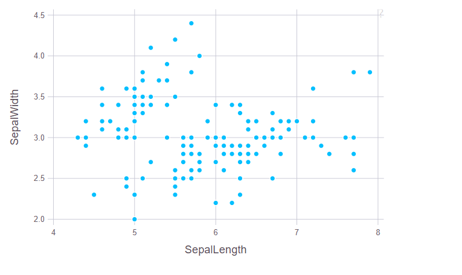

用颜色区分种类：

~~~julia
p = plot(iris, x = :SepalLength, y = :SepalWidth, Geom.point, color=:Species)
~~~

给每个点添加标签

~~~julia
p = plot(iris, x = :SepalLength, y = :SepalWidth,label = :Species ,color=:Species, Geom.point, Geom.label)
~~~

绘制子图

~~~julia
figla = plot(iris, x = "SepalLength", y = "SepalWidth", Geom.point);
figlb = plot(iris, x = "SepalWidth", Geom.bar);
figlb = hstack(figla, figlb)
~~~

### 概率分布

~~~julia
using Distributions
~~~

生成均值为$20$，标准差为$2.0$的正态分布

~~~julia
n1 = Normal(20, 2.0);
params(n1) #查看n1的参数
>> (20.0, 2.0)
fieldnames(typeof(n1)) #查看n1类型的参数
>> (:μ, :σ)
~~~

**Normal**的类型是`UnionAll`

~~~julia
typeof(Normal)
>> UnionAll
~~~

生成满足$n_1$模型的随机数

~~~julia
rand(n1,100)
~~~

#### 二项分布

~~~julia
b = Binomial(20, 0.8)
>> Binomial{Float64}(n=20, p=0.8)
rand(b, 100)
~~~

#### 概率密度

~~~julia
n = Normal();
pdf(n, 0.4) #标准正态分布在0.4处的概率密度值
>> 0.36827014030332333
~~~

#### 分布函数

~~~julia
cdf(n, 0.4) #标准正态分布在0.4处的分布函数值
>> 0.6554217416103242
~~~

#### 分位数

~~~julia
quantile.(n, [0.25, 0.5, 0.95]) #标准正态分布的分位数
>> 3-element Array{Float64,1}: 
 -0.6744897501960818        
  0.0                       
  1.6448536269514717        
~~~

对于随机数`rand(10)`，按`Normal`分布分析它的参数值

~~~julia
fit(Normal, rand(10))
>> Normal{Float64}(μ=0.512198197172256, σ=0.29727769329576403)
~~~

`StatsBase`库：里面也包含了统计学的常用函数

~~~julia
using StatsBase
~~~

~~~julia
a = collect(1:6);
b = collect(4:9);
countne(a,b) #按序列对比a和b中不一样的数据个数
>> 6
~~~

~~~julia
a = [1,2,3,4,5]
b = [4,1,3,2,5]
counteq(a,b) #a,b对应位置相同的数据个数
~~~

~~~julia
L1dist(a,b) #abs(a[1]-b[1]) + ... + abs(a[n]-b[n])
L2dist(a,b) #sqrt((a[1]-b[1])^2 + ... + (a[n]-b[n])^2)
~~~

~~~julia
meanad(a,b) #L1dist(a,b)/n
~~~

~~~julia
sample(a) #从a中采样一次数据
sample(a,3)#从a中取样3次数据，返回Array
~~~

~~~julia
a1 = [1, 10, 20, 30];
a2 = [100, 200, 300];
sample!(a1,a2)
3-element Array{Int64,1}:
 30
 10
 10
#从a1中抽取length(a2)个数据（有放回），数据类型与a2相同
~~~

~~~julia
a2 = [100.0, 200.0, 300.0];
sample!(a1,a2)
3-element Array{Float64,1}:
 30.0                      
 10.0                      
 20.0                      
~~~

#### 其他常用函数

~~~julia
x = [1.0, 2.0, 3.0, 4.0];
autocov(x)
autocov(x, [2,3])
autocor(x)
autocor(x, [2,3])
y = [3.0, 4.0, 5.0, 6.0]
crosscov(x, y)
crosscov(x, y, [2,3])
~~~

### 时间序列

~~~julia
using TimeSeries
~~~

~~~julia
date = collect(Date(2018,1,1):Day(1):Date(2018,12,31))
date[1:10]
10-element Array{Date,1}:
 2018-01-01
 2018-01-02
 2018-01-03
 2018-01-04
 2018-01-05
 2018-01-06
 2018-01-07
 2018-01-08
 2018-01-09
 2018-01-10
~~~

#### `TimeArray`

~~~julia
 ta = TimeArray(date, rand(length(date),2))
365×2 TimeArray{Float64,2,Date,Array{Float64,2}} 2018-01-01 to 2018-12-31
│            │ A      │ B      │
├────────────┼────────┼────────┤
│ 2018-01-01 │ 0.6689 │ 0.1202 │
│ 2018-01-02 │ 0.5996 │ 0.5531 │
│ 2018-01-03 │ 0.5734 │ 0.0708 │
│ 2018-01-04 │ 0.1313 │ 0.8755 │
│ 2018-01-05 │ 0.7922 │ 0.9192 │
│ 2018-01-06 │ 0.0437 │ 0.291  │
│ 2018-01-07 │ 0.2766 │ 0.7561 │
│ 2018-01-08 │ 0.5578 │ 0.1761 │
│ 2018-01-09 │ 0.678  │ 0.7213 │
│ 2018-01-10 │ 0.2261 │ 0.5037 │
│ 2018-01-11 │ 0.5553 │ 0.9619 │
│ 2018-01-12 │ 0.1517 │ 0.7192 │
   ⋮
│ 2018-12-21 │ 0.8126 │ 0.6199 │
│ 2018-12-22 │ 0.19   │ 0.0961 │
│ 2018-12-23 │ 0.6185 │ 0.9283 │
│ 2018-12-24 │ 0.6417 │ 0.4088 │
│ 2018-12-25 │ 0.1897 │ 0.7804 │
│ 2018-12-26 │ 0.8801 │ 0.5731 │
│ 2018-12-27 │ 0.2213 │ 0.9441 │
│ 2018-12-28 │ 0.6519 │ 0.1873 │
│ 2018-12-29 │ 0.0854 │ 0.0057 │
│ 2018-12-30 │ 0.5102 │ 0.6309 │
│ 2018-12-31 │ 0.8945 │ 0.6664 │
~~~

~~~julia
 timestamp(ta::TimeArray) #取出时间
365-element Array{Date,1}: 
 2018-01-01                
 2018-01-02                
 2018-01-03                
 2018-01-04                
 2018-01-05                
 2018-01-06                
 2018-01-07                
 2018-01-08                
 2018-01-09                
 2018-01-10                
 2018-01-11                
 2018-01-12                
 2018-01-13                
 ⋮                         
 2018-12-20                
 2018-12-21                
 2018-12-22                
 2018-12-23                
 2018-12-24                
 2018-12-25                
 2018-12-26                
 2018-12-27                
 2018-12-28                
 2018-12-29                
 2018-12-30                
 2018-12-31                

values(ta::TimeArray) #取出值
365×2 Array{Float64,2}: 
 0.668887   0.120241    
 0.599617   0.553089    
 0.573368   0.070834    
 0.131338   0.875542    
 0.79221    0.919241    
 0.0436837  0.291022    
 0.276555   0.756147    
 0.557788   0.176079    
 0.678009   0.721344    
 0.226109   0.503747    
 0.555307   0.961935    
 0.151684   0.719197    
 0.84211    0.602309    
 ⋮                      
 0.920065   0.659223    
 0.812629   0.619926    
 0.189965   0.0960546   
 0.618545   0.928288    
 0.641728   0.408813    
 0.189693   0.780418    
 0.880083   0.573097    
 0.221286   0.944118    
 0.651867   0.187301    
 0.0854492  0.00570113  
 0.510181   0.630856    
 0.894524   0.666362    

colnames(ta::TimeArray) #取出列名
2-element Array{Symbol,1}:  
 :A                         
 :B                         
~~~

### 机器学习

#### `ML Base`

~~~julia
using MLBase
~~~

机器学习基础库，不包含任何机器学习的算法，但为机器学习提供很多必要的工具。

先来看下`MLBase`中几个简单数据处理的函数

~~~julia
repeach(1:3,2) #重复数据
6-element Array{Int64,1}:  
 1                         
 1                         
 2                         
 2                         
 3                         
 3                         
repeach(["a", "b", "c"], 2)
6-element Array{String,1}:  
 "a"                        
 "a"                        
 "b"                        
 "b"                        
 "c"                        
 "c"                        
repeach(["a", "b", "c"], [1,2,3])
6-element Array{String,1}:
 "a"
 "b"
 "b"
 "c"
 "c"
 "c"
~~~

~~~julia
julia> A = reshape(collect(1:6), 2, 3)  
2×3 Array{Int64,2}:                     
 1  3  5                                
 2  4  6                                
                                        
julia> repeachcol(A,2)                  
2×6 Array{Int64,2}:                     
 1  1  3  3  5  5                       
 2  2  4  4  6  6                       
                                        
julia> repeachrow(A,2)                  
4×3 Array{Int64,2}:                     
 1  3  5                                
 1  3  5                                
 2  4  6                                
 2  4  6                                
~~~

~~~julia
julia> labels = labelmap(['a', 'b', 'b', 'c', 'c', 'c'])  #创建labelmap,会去除重复的
LabelMap (with 3 labels):                                 
[1] a                                                     
[2] b                                                     
[3] c      
julia> labelencode(labels, ['b','c','c','a'])#对标签进行编码
4-element Array{Int64,1}:
 2
 3
 3
 1
~~~

#### 决策树

使用`iris`数据集

~~~julia
using RDatasets
iris = dataset("datasets", "iris")
features = convert(Array, iris[:,1:4])
labels = convert(Array, iris[:,5])
~~~

调用决策树

~~~julia
using DecisionTree
~~~

在该库中，包括了

+ Decision Tree Classifier
+ Random Forest Classifier
+ Adaptive-Boosted Decision Stumps Classifier
+ Regression Tree
+ Regression Random Forest

我们这里只介绍分类模型，即前三种模型

~~~julia
model = build_tree(labels, features) #构建树
Decision Tree
Leaves: 9
Depth:  5
model = prune_tree(model, 0.9)#按照0.9的比例修剪树
Decision Tree
Leaves: 8
Depth:  5
# 打印模型
print_tree(model)
Feature 4, Threshold 0.8                  
L-> setosa : 50/50                        
R-> Feature 4, Threshold 1.75             
    L-> Feature 3, Threshold 4.95         
        L-> Feature 4, Threshold 1.65     
            L-> versicolor : 47/47        
            R-> virginica : 1/1           
        R-> Feature 4, Threshold 1.55     
            L-> virginica : 3/3           
            R-> Feature 1, Threshold 6.95 
                L-> versicolor : 2/2      
                R-> virginica : 1/1       
    R-> Feature 3, Threshold 4.85         
        L-> Feature 1, Threshold 5.95     
            L-> versicolor : 1/1          
            R-> virginica : 2/2           
        R-> virginica : 43/43             

print_tree(model,3)
Feature 4, Threshold 0.8           
L-> setosa : 50/50                 
R-> Feature 4, Threshold 1.75      
    L-> Feature 3, Threshold 4.95  
        L->                        
        R->                        
    R-> Feature 3, Threshold 4.85  
        L->                        
        R-> virginica : 43/43    

# 利用模型做预测
apply_tree(model, [1.9,2.0,2.1,1.9])
>> "versicolor"

~~~

##### 交叉验证

~~~julia
n_folds = 3
accuracy = nfoldCV_tree(labels, features, n_folds, 0.9)
# 分成3组进行交叉验证，按照0.9剪切树
Fold 1                                                 
Classes:  ["setosa", "versicolor", "virginica"]        
Matrix:   3×3 Array{Int64,2}:                          
 17   0   0                                            
  0  12   1                                            
  0   1  19                                            
                                                       
Accuracy: 0.96                                         
Kappa:    0.9390986601705237                           
                                                       
Fold 2                                                 
Classes:  ["setosa", "versicolor", "virginica"]        
Matrix:   3×3 Array{Int64,2}:                          
 18   0   0                                            
  0  17   1                                            
  0   1  13                                            
                                                       
Accuracy: 0.96                                         
Kappa:    0.9396135265700483                           
                                                       
Fold 3                                                 
Classes:  ["setosa", "versicolor", "virginica"]        
Matrix:   3×3 Array{Int64,2}:                          
 15   0   0                                            
  0  18   1                                            
  0   1  15                                            
                                                       
Accuracy: 0.96                                         
Kappa:    0.9396863691194209                           
                                                       
Mean Accuracy: 0.96                                    
3-element Array{Float64,1}:                            
 0.96                                                  
 0.96                                                  
 0.96                                                  
~~~

##### `adaptive boosting`模型

构造`adaptive boosting`模型

~~~julia
 modell, coeffs = build_adaboost_stumps(labels, features,10) #10指树的数量
(Ensemble of Decision Trees                                                                                                                                                                                        
Trees:      10                                                                                                                                                                                                     
Avg Leaves: 2.0                                                                                                                                                                                                    
Avg Depth:  1.0, [0.3465735902799726, 0.25541281188299536, 0.2645768713851454, 0.3357494610262844, 0.28884625587396767, 0.2582865965088567, 0.35688249756171214, 0.29876564303107633, 0.24248457726633457, 0.3499761902694112])      

 apply_adaboost_stumps(modell, coeffs,[1.9,2.0,2.1,1.9])
>> "virginica"

# 进行交叉验证，3组，迭代8次
accuracy = nfoldCV_stumps(labels, features, 3,8)
Fold 1                                                        
Classes:  ["setosa", "versicolor", "virginica"]               
Matrix:   3×3 Array{Int64,2}:                                 
 19   0   0                                                   
  0  17   0                                                   
  0   2  12                                                   
                                                              
Accuracy: 0.96                                                
Kappa:    0.9393203883495145                                  
                                                              
Fold 2                                                        
Classes:  ["setosa", "versicolor", "virginica"]               
Matrix:   3×3 Array{Int64,2}:                                 
 9   0   0                                                    
 0  19   3                                                    
 0   1  18                                                    
                                                              
Accuracy: 0.92                                                
Kappa:    0.8734177215189874                                  
                                                              
Fold 3                                                        
Classes:  ["setosa", "versicolor", "virginica"]               
Matrix:   3×3 Array{Int64,2}:                                 
 22   0   0                                                   
  0  10   1                                                   
  0   0  17                                                   
                                                              
Accuracy: 0.98                                                
Kappa:    0.96875                                             
                                                              
Mean Accuracy: 0.9533333333333333                             
3-element Array{Float64,1}:                                   
 0.96                                                         
 0.92                                                         
 0.98                                                         
~~~

##### 随机森林

构建随机森林模型

~~~julia
# 2表示2个随机特征，10个树，0.5的样本
model = build_forest(labels, features, 2, 10, 0.5)
Ensemble of Decision Trees
Trees:      10            
Avg Leaves: 7.6           
Avg Depth:  4.9           
~~~

应用模型判断

~~~julia
apply_forest(model, [5.9,3.0,5.1,1.9])
>> "virginica"
~~~

交叉验证

~~~julia
accuracy = nfoldCV_forest(labels, features, 3, 2)
Fold 1                                                        
Classes:  ["setosa", "versicolor", "virginica"]               
Matrix:   3×3 Array{Int64,2}:                                 
 16   0   0                                                   
  0  15   2                                                   
  0   0  17                                                   
                                                              
Accuracy: 0.96                                                
Kappa:    0.9399759903961584                                  
                                                              
Fold 2                                                        
Classes:  ["setosa", "versicolor", "virginica"]               
Matrix:   3×3 Array{Int64,2}:                                 
 15   0   0                                                   
  0  17   1                                                   
  0   2  15                                                   
                                                              
Accuracy: 0.94                                                
Kappa:    0.9096929560505719                                  
                                                              
Fold 3                                                        
Classes:  ["setosa", "versicolor", "virginica"]               
Matrix:   3×3 Array{Int64,2}:                                 
 19   0   0                                                   
  0  15   0                                                   
  0   0  16                                                   
                                                              
Accuracy: 1.0                                                 
Kappa:    1.0                                                 
                                                              
Mean Accuracy: 0.9666666666666667                             
3-element Array{Float64,1}:                                   
 0.96                                                         
 0.94                                                         
 1.0                                                          
~~~

#### `MultivariateStats`

​	`PCA(Principal Component Analysis)`是一种常用的数据分析方法。`PCA`通过线性变换将原始数据变换为一组各维度线性无关的表示，可用于提取数据的主要特征分量，常用于高维数据的降维。

~~~julia
using MultivariateStats, RDatasets
#读取鸢尾花数据集
iris = dataset("datasets", "iris")
#将一半数据分割为训练集
Xtr = convert(Array, iris[1:2:end, 1:4])'
Xtr_labels = convert(Array, iris[1:2:end, 5])
#将另一半分割为验证集
Xte = convert(Array, iris[2:2:end, 1:4])'
Xte_labels = convert(Array, iris[2:2:end, 5])
# Xtr和Xte应为数据矩阵，每一列为一个观测
# 训练一个PCA模型，其最大的维度为3
M = fit(PCA, Xtr; maxoutdim=3)
>> PCA(indim = 4, outdim = 3, principalratio = 0.9957325846529407)
# 将训练出的模型用在验证集上
Yte = MultivariateStats.transform(M, Xte)
3×75 Array{Float64,2}:
  2.72714    2.75491    2.32396    2.65105     2.68917    2.63367     3.22638    2.44774   2.67677    …  -1.42529    -3.0342    -1.88009    -2.07575    -1.89212   -2.53304   -1.92047   -1.74161   -1.37706
 -0.230916  -0.406149   0.646374   0.0828144  -0.17411   -0.0825183  -0.614305   1.22392   0.228492      -0.0830416   0.833224   0.0858051   0.444162    0.476081   0.329041   0.246554   0.127625  -0.280295
 -0.253119  -0.0271266  0.230469  -0.0252853  -0.231507   0.0820979  -0.0211085  0.406469  0.0386127     -0.181381   -0.269449   0.155163    0.0540889   0.1407     0.309265   0.180044   0.123165   0.314992
# 重构数据
Xr = reconstruct(M, Yte)
4×75 Array{Float64,2}:                                                                           
 4.86449  4.61087   5.40782   5.00775   4.90864   …  6.76852  6.79346  6.58825  6.46774  5.94384 
 3.04262  3.08695   3.89061   3.39069   3.08963      3.25784  3.20785  3.13416  3.03873  2.94737 
 1.46099  1.48132   1.68656   1.48668   1.48516      5.32585  5.91124  5.39197  5.25542  5.02469 
 0.10362  0.229519  0.421233  0.221041  0.123445     1.9431   2.28224  1.99665  1.91243  1.91901 

# 将数据按照花的种类进行分组
setosa = Yte[:, Xte_labels.=="setosa"]
versicolor = Yte[:, Xte_labels.=="versicolor"]
virginica = Yte[:, Xte_labels.=="virginica"]
~~~

把降维后的数据画出来

~~~julia
using Plots
p = scatter(setosa[1,:], setosa[2,:], setosa[3,:], marker=:circle, linewidth=0)
scatter!(versicolor[1,:], versicolor[2,:], versicolor[3,:], marker=:circle, linewidth=0)
scatter!(virginica[1,:], virginica[2,:], virginica[3,:], marker=:circle, linewidth=0)
~~~

#### `SVM`

~~~julia
using LIBSVM
iris = dataset("datasets", "iris")
features = convert(Array, iris[:,1:4])
labels = convert(Array, iris[:,5])
features_train, features_test = features[1:2:end,:], features[2:2:end,:]
labels_train, labels_test = labels[1:2:end], labels[2:2:end]
~~~

~~~julia
model = svmtrain(features_train', labels_train)
#进行预测
(predicted_labels, decision_values) = svmpredict(model, features_test')
#统计准确率
using Statistics
mean(predicted_labels.==labels_test)*1.0
>> 0.9333333333333333
~~~

#### 线性回归

~~~julia
using GLM, GLMNet, DataFrames
data = DataFrame(X=[1,2,3],Y=[2,4,7]);
ols = lm(@formula(Y~X),data)
>> StatsModels.TableRegressionModel{LinearModel{GLM.LmResp{Array{Float64,1}},GLM.DensePredChol{Float64,LinearAlgebra.Cholesky{Float64,Array{Float64,2}}}},Array{Float64,2}}

Y ~ 1 + X

Coefficients:
─────────────────────────────────────────────────────────────────────────
                 Coef.  Std. Error      t  Pr(>|t|)  Lower 95%  Upper 95%
─────────────────────────────────────────────────────────────────────────
(Intercept)  -0.666667    0.62361   -1.07    0.4788   -8.59038    7.25704
X             2.5         0.288675   8.66    0.0732   -1.16797    6.16797
─────────────────────────────────────────────────────────────────────────
~~~

##### 标准差

~~~julia
stderror(ols)
>> 2-element Array{Float64,1}:
 0.6236095644623245
 0.2886751345948133
~~~

##### 应用模型

~~~julia
newX = DataFrame(X = [2,3,4]);
GLM.predict(ols, newX)
3-element Array{Union{Missing, Float64},1}:
 4.333333333333332
 6.833333333333335
 9.33333333333334
~~~

##### `glm`模型

~~~julia
data = DataFrame(X=[0,1,2,3,4], Y=[0.1296, 0.0864, 0.0576, 0.0384, 0.0256])
probit = glm(@formula(Y~X), data, Binomial(), ProbitLink())
>>
StatsModels.TableRegressionModel{GeneralizedLinearModel{GLM.GlmResp{Array{Float64,1},Binomial{Float64},ProbitLink},GLM.DensePredChol{Float64,LinearAlgebra.Cholesky{Float64,Array{Float64,2}}}},Array{Float64,2}}

Y ~ 1 + X

Coefficients:
─────────────────────────────────────────────────────────────────────────
                 Coef.  Std. Error      z  Pr(>|z|)  Lower 95%  Upper 95%
─────────────────────────────────────────────────────────────────────────
(Intercept)  -1.14184     1.32729   -0.86    0.3896   -3.74329    1.45961
X            -0.208282    0.659277  -0.32    0.7521   -1.50044    1.08388
─────────────────────────────────────────────────────────────────────────

~~~

~~~julia
GLM.predict(probit, newX)
4-element Array{Union{Missing, Float64},1}: 
 0.08848881841365534                        
 0.05956903371757441                        
 0.038640604730983866                       
 0.024136013530037453                       
~~~

线性回归模型处理`iris`数据集

~~~julia
data = DataFrame();
data[:x] = iris[1:50, :SepalWidth]
data[:y] = iris[1:50, :SepalLength]
~~~

~~~julia
model = lm(@formula(y~x), data)
StatsModels.TableRegressionModel{LinearModel{GLM.LmResp{Array{Float64,1}},GLM.DensePredChol{Float64,LinearAlgebra.Cholesky{Float64,Array{Float64,2}}}},Array{Float64,2}}

y ~ 1 + x

Coefficients:
──────────────────────────────────────────────────────────────────────
               Coef.  Std. Error     t  Pr(>|t|)  Lower 95%  Upper 95%
──────────────────────────────────────────────────────────────────────
(Intercept)  2.639     0.310014   8.51    <1e-10   2.01568    3.26233
x            0.69049   0.0898989  7.68    <1e-9    0.509736   0.871244
──────────────────────────────────────────────────────────────────────
~~~

将拟合的结果与原数据做对比

~~~julia
plot(GLM.predict(model))
plot!(data[:y])
~~~

用`GLM`模型处理`iris`数据集

~~~julia
model = glm(@formula(y~x), data, Normal(), IdentityLink())
>> StatsModels.TableRegressionModel{GeneralizedLinearModel{GLM.GlmResp{Array{Float64,1},Normal{Float64},IdentityLink},GLM.DensePredChol{Float64,LinearAlgebra.Cholesky{Float64,Array{Float64,2}}}},Array{Float64,2}}

y ~ 1 + x

Coefficients:
──────────────────────────────────────────────────────────────────────
               Coef.  Std. Error     z  Pr(>|z|)  Lower 95%  Upper 95%
──────────────────────────────────────────────────────────────────────
(Intercept)  2.639     0.310014   8.51    <1e-16   2.03138    3.24662
x            0.69049   0.0898989  7.68    <1e-13   0.514291   0.866688
──────────────────────────────────────────────────────────────────────
~~~

#### `K-means`

~~~julia
using Clustering
using RDatasets
iris = dataset("datasets", "iris")
features = convert(Array, iris[:,1:4])
labels = convert(Array, iris[:,5])
~~~

~~~julia
#随机选择三个点作为分类起始点
initseeds(:rand, convert(Matrix, features'),3)
>> 3-element Array{Int64,1}: 
  39                      
 122                      
  22                      
~~~

~~~julia
# 建立模型 
result = kmeans(features, 3)
~~~

~~~julia
# 绘制分类后的模型
using Gadfly
Gadfly.plot(iris, x = "PetalLength", y = "PetalWidth", color=result.assignments,Geom.point)
~~~

## 如何写出高性能的`Julia`代码

### 避免全局变量

全局变量的值和类型随时都会发生改变。这使编译器难以优化使用全局变量的代码。变量应该是局部的，或者尽可能作为参数传递给函数。

**任何注重性能或者需要测试性能的代码都应该被放置在函数之中。**

把全局变量声明为常量可以巨大地提升性能。

~~~julia
const VAL = 0
~~~

如果必须要声明全局变量，可以在使用它的地方标注他们的类型来优化效率。

~~~julia
global x = rand(10000)

function lpl()
    s = 0.0
    for i in x
        s+=i
    end
end
~~~

使用`@time`来估算代码运行的时间

~~~julia
@time lpl()
>> 0.001313 seconds (39.49 k allocations: 773.281 KiB)
# 发现占用了较大的内存空间，说明代码需要优化
~~~

~~~julia
function lp2()
    a = 0.0
    for i in x::Vector{Float64}
        a += i
    end
end
~~~

~~~julia
@time lp2()
>> 0.000006 seconds
~~~

~~~julia
function lp3(x)
    s = 0.0
    for i in x
        s+=i
    end
end
~~~

~~~julia
@time lp3(x)
>> 0.000005 seconds
~~~

在全局内运行宏也会占用一定的存储空间和时间，为了节省时间，可以将宏定义为函数。

~~~julia
time_sum(x) = @time lp3(x)
>> time_sum (generic function with 1 method)
time_sum(x)
>> 0.000000 seconds
~~~

对于更加正式的性能测试，可以使用`BenchmarkTools`包，这个包会多次评估函数的性能以降低噪声。

~~~julia
using BenchmarkTools
@benchmark lpl()
@benchmark lp2()
@benchmark lp3(x)
~~~

### `code generation`

在`REPL`中，我们输入`@code`来查看用于`code generation`的宏

+ `@code_lowered`:`Julia`底层的运行过程
+ `@code_typed`:程序运行时`type`的变化
+ `@code_llvm`:`llvm`编译器运行过程
+ `@code_native`:生成程序运行的机器语言
+ `@code_warntypes`:查看程序运行时是否由类型上的`warning`

首先我们定义一个简单的函数

~~~julia
cal(a, b, c) = a + b + c
>> cal (generic function with 1 method)
cal(1,2,3)
>> 6
cal(1.0, 2.0, 3.0)
>> 6.0
cal(1.0, 2.0, 3)
>> 6.0
~~~

用`@code_lowered`查看底层运行过程

~~~julia
julia> @code_lowered cal(1,2,3)        
CodeInfo(                              
1 ─ %1 = a + b + c                     
└──      return %1                     
)                                      
                                       
julia> @code_lowered cal(1.0,2.0,3.0)  
CodeInfo(                              
1 ─ %1 = a + b + c                     
└──      return %1                     
)                                      
                                       
julia> @code_lowered cal(1.0,2.0,3)    
CodeInfo(                              
1 ─ %1 = a + b + c                     
└──      return %1                     
)                                      
~~~

~~~julia
julia> @code_typed cal(1,2,3)             
CodeInfo(                                 
1 ─ %1 = Base.add_int(a, b)::Int64        
│   %2 = Base.add_int(%1, c)::Int64       
└──      return %2                        
) => Int64                                
                                          
julia> @code_typed cal(1.0,2.0,3.0)       
CodeInfo(                                 
1 ─ %1 = Base.add_float(a, b)::Float64    
│   %2 = Base.add_float(%1, c)::Float64   
└──      return %2                        
) => Float64                              
                                          
julia> @code_typed cal(1,2,3.0)           
CodeInfo(                                 
1 ─ %1 = Base.add_int(a, b)::Int64        
│   %2 = Base.sitofp(Float64, %1)::Float64
│   %3 = Base.add_float(%2, c)::Float64   
└──      return %3                        
) => Float64                              
~~~

~~~julia
julia> @code_llvm cal(1,2,3)                                                
                                                                            
;  @ REPL[79]:1 within `cal'                                                
; Function Attrs: uwtable                                                   
define i64 @julia_cal_22890(i64, i64, i64) #0 {                             
top:                                                                        
; ┌ @ operators.jl:529 within `+' @ int.jl:53                               
   %3 = add i64 %1, %0                                                      
   %4 = add i64 %3, %2                                                      
; └                                                                         
  ret i64 %4                                                                
}                                                                           
                                                                            
julia> @code_llvm cal(1.0,2.0,3.0)                                          
                                                                            
;  @ REPL[79]:1 within `cal'                                                
; Function Attrs: uwtable                                                   
define double @julia_cal_22891(double, double, double) #0 {                 
top:                                                                        
; ┌ @ operators.jl:529 within `+' @ float.jl:401                            
   %3 = fadd double %0, %1                                                  
   %4 = fadd double %3, %2                                                  
; └                                                                         
  ret double %4                                                             
}                                                                           
                                                                            
julia> @code_llvm cal(1,2,3.0)                                              
                                                                            
;  @ REPL[79]:1 within `cal'                                                
; Function Attrs: uwtable                                                   
define double @julia_cal_23019(i64, i64, double) #0 {                       
top:                                                                        
; ┌ @ operators.jl:529 within `+' @ int.jl:53                               
   %3 = add i64 %1, %0                                                      
; │ @ operators.jl:529 within `+' @ promotion.jl:311                        
; │┌ @ promotion.jl:282 within `promote'                                    
; ││┌ @ promotion.jl:259 within `_promote'                                  
; │││┌ @ number.jl:7 within `convert'                                       
; ││││┌ @ float.jl:60 within `Float64'                                      
       %4 = sitofp i64 %3 to double                                         
; │└└└└                                                                     
; │ @ operators.jl:529 within `+' @ promotion.jl:311 @ float.jl:401         
   %5 = fadd double %4, %2                                                  
; └                                                                         
  ret double %5                                                             
}                                                                           
                                                                            
~~~

~~~julia
julia> @code_native cal(1,2,3)
        .text
; ┌ @ REPL[79]:1 within `cal'
        pushq   %rbp
        movq    %rsp, %rbp
; │┌ @ operators.jl:529 within `+' @ int.jl:53
        leaq    (%rcx,%rdx), %rax
        addq    %r8, %rax
; │└
        popq    %rbp
        retq
        nopl    (%rax)
; └

julia> @code_native cal(1.0,2.0,3.0)
        .text
; ┌ @ REPL[79]:1 within `cal'
        pushq   %rbp
        movq    %rsp, %rbp
; │┌ @ operators.jl:529 within `+' @ float.jl:401
        vaddsd  %xmm1, %xmm0, %xmm0
        vaddsd  %xmm2, %xmm0, %xmm0
; │└
        popq    %rbp
        retq
        nop
; └

julia> @code_native cal(1,2,3.0)
        .text
; ┌ @ REPL[79]:1 within `cal'
        pushq   %rbp
        movq    %rsp, %rbp
; │┌ @ operators.jl:529 within `+' @ int.jl:53
        addq    %rdx, %rcx
; ││ @ operators.jl:529 within `+' @ promotion.jl:311
; ││┌ @ promotion.jl:282 within `promote'
; │││┌ @ promotion.jl:259 within `_promote'
; ││││┌ @ number.jl:7 within `convert'
; │││││┌ @ float.jl:60 within `Float64'
        vcvtsi2sdq      %rcx, %xmm0, %xmm0
; ││└└└└
; ││ @ operators.jl:529 within `+' @ promotion.jl:311 @ float.jl:401
        vaddsd  %xmm2, %xmm0, %xmm0
; │└
        popq    %rbp
        retq
        nopw    %cs:(%rax,%rax)
        nopl    (%rax)
; └
~~~

### 抽象和具体类型

当我们定义一个函数时，如果函数的参数的类型是固定的，比如是一个`int64`的`Array[1,2,3,4]`，那么他们在内存中会连续存放：

但是如果函数的参数类型是`Any`，那么内存中连续存放的只是他们的“指针”，会指向其实际的位置。这样一来，数据存储就慢下来了。

来看下面的例子：

### 隐藏的类型转换

在`C++`中，对每个定义的变量都有其固定的类型，但`Julia`中由于变量的定义过程中可以缺省参数，经常会注意不到参数类型的转换。

我们在定义变量时，要尽量保持与后面运算时的类型保持一致。有几个函数可以帮助我们完成这种定义。

+ `zero(value)`
+ `eltype(array)`
+ `one(value)`
+ `similar(value)`

~~~julia
pos(x) = x < 0 ? zero(x) : x #当x小于时返回与x类型相一致的0
~~~

### 避免拥有抽象类型参数的容器

在定义`struct`时，我们经常会这样写

~~~julia
mutable struct MyType1
	x::AbstractFloat
end
~~~

但用下面的写法更好

~~~julia
mutable struct MyType2{T<:AbstractFloat}
	x::T
end
~~~

查看他们的类型：

~~~julia
julia> a = MyType1(2.3)
MyType1(2.3)           
                       
julia> typeof(a)       
MyType1                
                       
julia> b = MyType2(2.3)
MyType2{Float64}(2.3)  
                       
julia> typeof(b)       
MyType2{Float64}       
~~~

`x`的类型可以由`b`的类型决定，但不能由`a`的类型决定。`b.x`的类型不会改变，永远都是`Float64`，而`a.x`的类型则会改变。

~~~julia
julia> typeof(a.x) 
Float64            
                   
julia> typeof(b.x) 
Float64            
~~~

~~~julia
julia> a.x = 2.3f0    
2.3f0                 
                      
julia> typeof(a.x)    
Float32               
                      
julia> b.x = 2.3f0    
2.3f0                 
                      
julia> typeof(b.x)    
Float64               
~~~

当某个包含多个变量的`Array`中，如果我们知道某个变量的类型，就明确指出来。

~~~julia
function foo(a::Array{Any, 1})
    x = a[1]::Int32
    b = x + 1
    ...
end
~~~

如果只能确定`x`的类型，但`a[1]`的类型不能确定，可以用`convert()`来完成。

~~~julia
x = convert(Int32, a[1])::Int32
~~~

从上面我们讲的这些内容也可以知道优化代码的一个策路：程序越简单越好，让编译器明确知道自己想干什么，而不是让编译器去猜我们的目的。

因此可以推断出有可变参数类型的函数肯定不如固定关键字参数类型的函数运行的快。

但这种指定某个变量类型在使用时要注息一点，就是如果变量类型不是在编译时确定而是在运行时才确定，那会有损性能。

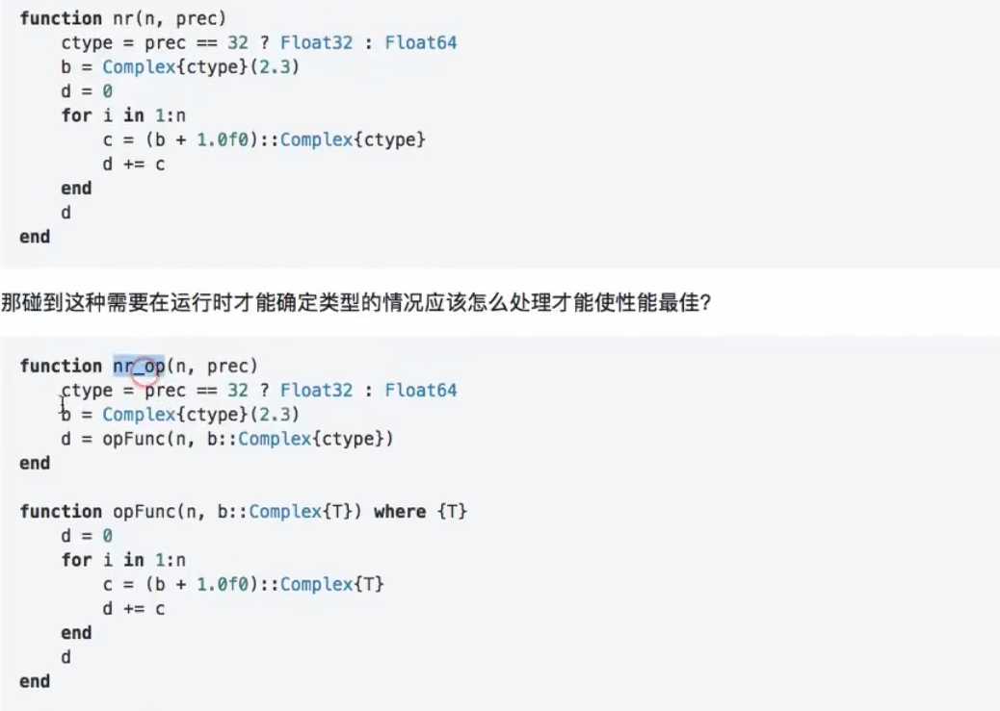

### 参数类型优化  方法的妙用

当我们的类型是函数参数时，也要用上面的方式先获取

~~~julia
#定义一个N维矩阵
function array3(fillval, N)
    fill(fillval, ntuple(d->3, N))
end
# ntuple(d->3, 4)  (3, 3, 3, 3)
~~~

~~~julia
array3(2.0, 4)
3×3×3×3 Array{Float64
[:, :, 1, 1] =       
 2.0  2.0  2.0       
 2.0  2.0  2.0       
 2.0  2.0  2.0       
                     
[:, :, 2, 1] =       
 2.0  2.0  2.0       
 2.0  2.0  2.0       
 2.0  2.0  2.0       
                     
[:, :, 3, 1] =       
 2.0  2.0  2.0       
 2.0  2.0  2.0       
 2.0  2.0  2.0       
                     
[:, :, 1, 2] =       
 2.0  2.0  2.0       
 2.0  2.0  2.0       
 2.0  2.0  2.0       
                     
[:, :, 2, 2] =       
 2.0  2.0  2.0       
 2.0  2.0  2.0       
 2.0  2.0  2.0       
                     
[:, :, 3, 2] =       
 2.0  2.0  2.0       
 2.0  2.0  2.0       
 2.0  2.0  2.0       
                     
[:, :, 1, 3] =       
 2.0  2.0  2.0       
 2.0  2.0  2.0       
 2.0  2.0  2.0       
                     
[:, :, 2, 3] =       
 2.0  2.0  2.0       
 2.0  2.0  2.0       
 2.0  2.0  2.0       
                     
[:, :, 3, 3] =       
 2.0  2.0  2.0       
 2.0  2.0  2.0       
 2.0  2.0  2.0       

typeof(array3(2.0, 4))
>> Array{Float64,4}
~~~

这里的N是矩阵的类型参数，该矩阵是一个N维的。同样存在的问题，该矩阵变量的类型参数就是N的值，如果我们先获取了N的值后再进行矩阵生成，性能会更好。

~~~julia
function array3(fillval, ::Val{N}) where N
    fill(fillval, ntupled(d->3, Val(N)))
end
~~~

在使用`Val()`时，一定要注意使用方式，如果使用不当，则比不使用`Val()`性能更差。

~~~julia
function call_array3(fillval, n)
    A = array3(fillval, Val(n))
end
~~~

这样编译器就不知道`n`是个什么东西，也不知道`n`的类型，跟我们的初衷南辕北辙。

我们再举个可变参数和关键字参数的例子说明两者运行的时间差异。

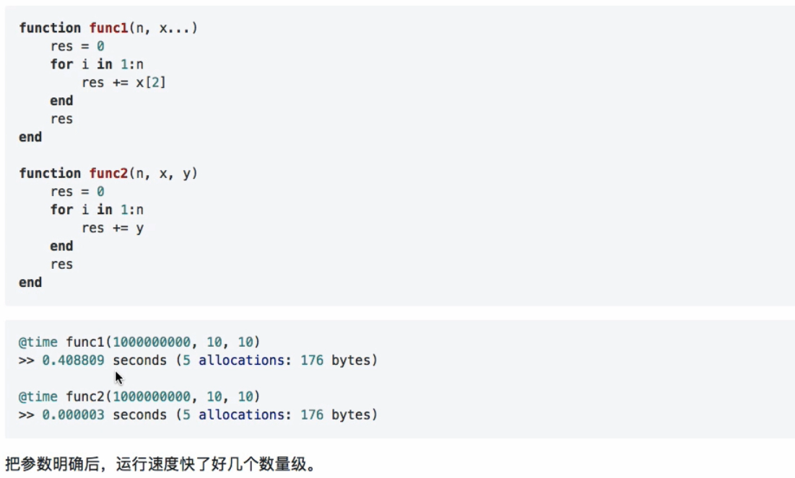

#### 用方法代替函数中的条件判断

### 矩阵优化

在`Julia`中，多维矩阵是以列优先原则排列的，这跟`Matlab`中是一致的。

~~~julia
julia> x = [1 2;3 4]         
2×2 Array{Int64,2}:          
 1  2                        
 3  4                        
                             
julia> x[:]                  
4-element Array{Int64,1}:    
 1                           
 3                           
 2                           
 4                           

~~~

也就是说，`Julia`中矩阵的每一列的数据在内存中是连续的，每一行是不连续的，操作连续地址比非连续地址要快得多。

~~~julia
# 按列拷贝
function copy_cols(x::Vector{T}) where T
    inds = axes(x, 1)
    out = similar(Array{T}, inds, inds)
    for i = inds
        out[:, i] = x
    end
    return out
end

# 按行拷贝
function copy_rows(x::Vector{T}) where T
    inds = axes(x, 1)
    out = similar(Array{T}, inds, inds)
    for i = inds
        out[i, :] = x
    end
    return out
end

# 按元素拷贝，以列为顺序
function copy_col_row(x::Vector{T}) where T
    inds = axes(x, 1)
    out = similar(Array{T}, inds, inds)
    for col = inds, row = inds
        out[row, col] = x[row]
    end
    return out
end

# 按元素拷贝，以行为顺序
function copy_row_col(x::Vector{T}) where T
    inds = axes(x, 1)
    out = similar(Array{T}, inds, inds)
    for row = inds, col = inds
        out[row, col] = x[col]
    end
    return out
end

x = randn(10000)
fmt(f) = println(rpad(string(f)*":", 14, ' '), @elapsed f(x))
map(fmt, Any[copy_cols, copy_rows, copy_col_row, copy_row_col])

>>
copy_cols:    0.418630701
copy_rows:    1.316161499
copy_col_row: 0.458879701
copy_row_col: 1.1687943
~~~

#### `dot`运算

在矩阵操作中，操作符前面加上`.`，看下面的例子

~~~julia
f(x) = 5x.^3 - 2x.^2 + 3x
>> f (generic function with 1 method)
fdot(x) = @. 5x^3 - 2x^2 + 3x
>> fdot (generic function with 1 method)
~~~

~~~julia
x = rand(10^6);
@time f(x)
>>  0.452430 seconds (383.01 k allocations: 73.068 MiB, 3.77% gc time)
@time fdot(x)
>> 0.307250 seconds (829.29 k allocations: 47.215 MiB)
@time f.(x) #同fdot(x)
>>  0.003293 seconds (4 allocations: 7.630 MiB)
~~~

可以看出，点乘操作要快很多

**向量化并不会提高`Julia`的运行速度**

很多用过`Matlab`和`Python`的同学都觉得向量操作肯定要比循环快很多，但在`Julia`中没有这个规则

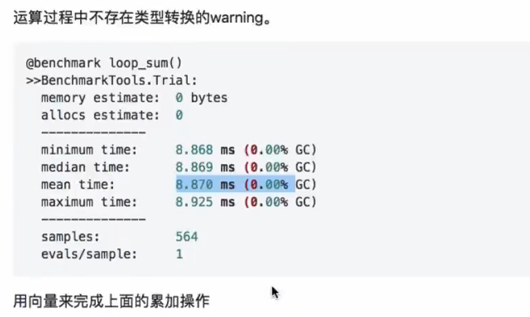

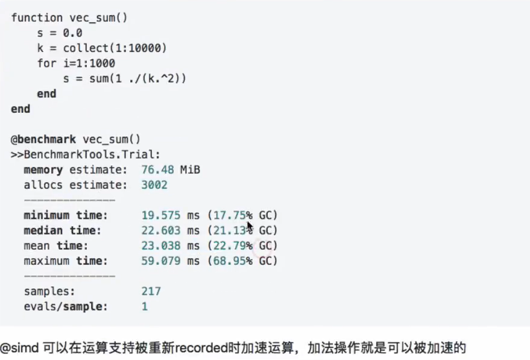

### 输出预分配

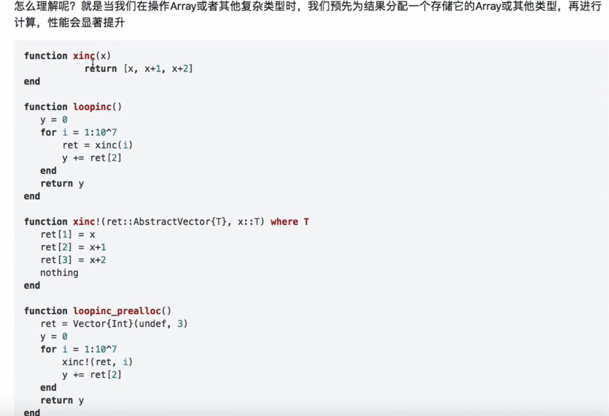

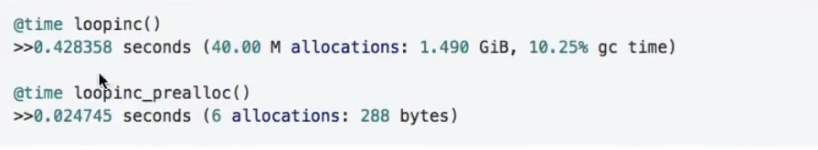

### `copy`和`view`

### `IO`操作优化

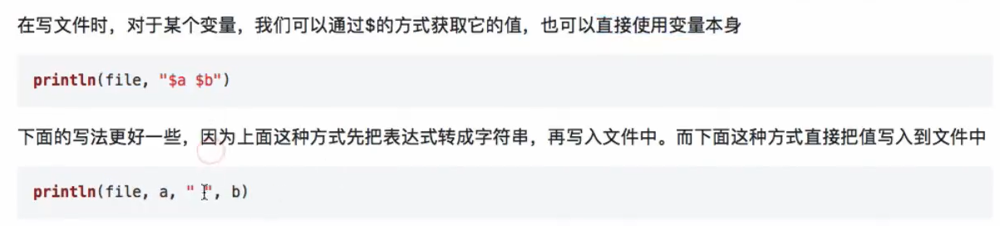

### 其他优化小技巧

